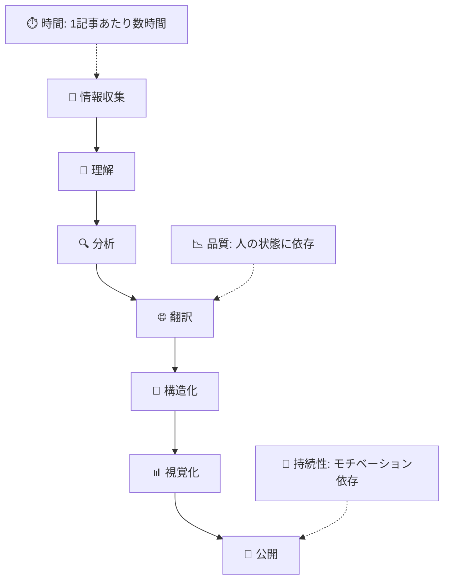
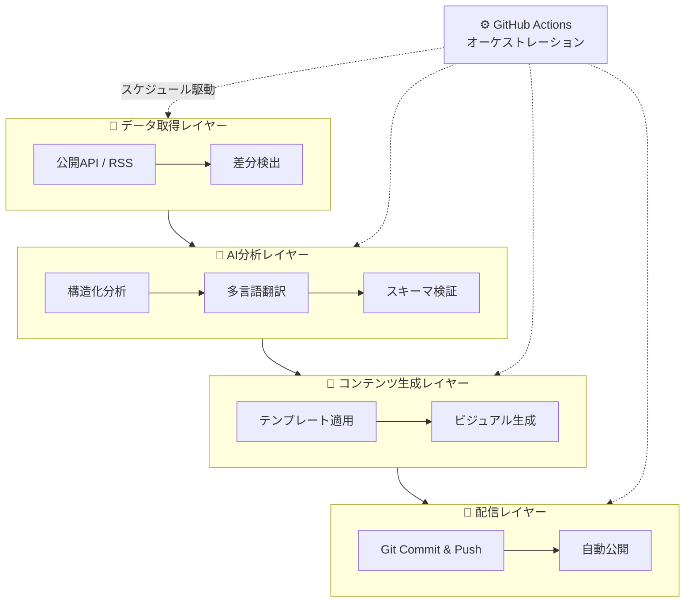
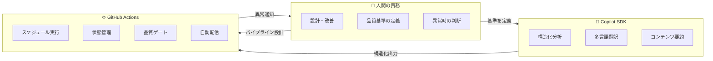
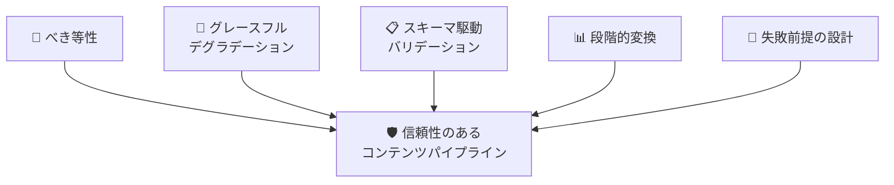

## はじめに

GitHub Changelog を日々追いかけている方は、どれくらいいるでしょうか。

私は Microsoft で Developer Productivity の領域に関わる中で、GitHub の最新動向を常にキャッチアップし、日本語で情報を発信し続けてきました。しかし、GitHub Changelog は年間数百件以上のアップデートが公開されます。しかも、すべて英語です。

これを毎日読み、理解し、分析し、日本語に翻訳し、記事として構成し、公開する ―― この一連の作業を手動で続けることには、いつか限界が来ると感じていました。

そこで考えたのが、**Copilot SDK と GitHub Actions を組み合わせた AI 駆動のコンテンツパイプライン**です。

この記事では、実装の詳細には触れません。お伝えしたいのは、**設計思想とアプローチ**です。「どう作ったか」ではなく、「なぜこう設計したか」「どういう考え方で自動化に取り組んだか」を共有します。

そして、この考え方は GitHub Changelog に限ったものではありません。以下のような場面にも応用できるはずです。

- OSS プロジェクトの更新情報を社内に展開する
- 社内技術広報やナレッジ共有を定期的に発信する
- 学習ログや技術メモを継続的に公開する
- リリースノートを多言語で展開する

**「定期的に、繰り返し、一定の品質で、コンテンツを届け続けたい」** ―― そう感じたことがある方に、この記事が何かのヒントになれば幸いです。

---

## 手作業運用の限界

技術情報を日本語で読者に届けるまでには、実は多くの工程があります。

1. **情報収集** — RSS やブログを巡回し、新しいアップデートを見つける
2. **理解** — 英語の技術文を読み解き、背景や文脈を把握する
3. **分析** — 影響範囲、技術的な意味、セキュリティ上の考慮点を考察する
4. **翻訳** — 自然な日本語に変換する（機械翻訳そのままでは不十分）
5. **構造化** — 読みやすい記事構成に整理する
6. **視覚化** — 図表やスライドを作成し、理解を助ける
7. **公開** — プラットフォームに投稿する

これらすべてに人間のコストがかかります。そして、手動で続ける限り、4 つの限界から逃れられません。

- **鮮度の劣化** ―― 翻訳に時間がかかるほど、情報の価値は下がる
- **品質のばらつき** ―― 人の状態によって分析の深さが変わる
- **カバレッジの制約** ―― すべてのアップデートを追いきれない
- **持続性の課題** ―― モチベーションに依存する継続は脆い

ここで重要なのは、**1 回だけなら手動の方が速い**ということです。パイプラインを構築するコストは小さくありません。しかし、**毎日・毎週繰り返す作業であれば話は変わります**。反復回数が増えるほど、自動化の価値は増していきます。

---

## なぜ Content as Code なのか

### コンテンツにソフトウェアエンジニアリングの規律を

私がたどり着いたアプローチは、**Content as Code** という考え方です。ソフトウェア開発で当たり前に使われているベストプラクティスを、コンテンツ制作に適用する思想です。

これは単なるキャッチコピーではありません。Content as Code には **3 つの具体的な性質**があります。

1. **再現可能である（Reproducible）** ―― 同じ入力に対して、一貫した品質の出力が得られる
2. **検証可能である（Verifiable）** ―― 品質をスキーマで定義し、機械的に検証できる
3. **分解して自動化できる（Decomposable & Automatable）** ―― 各工程を独立させ、CI/CD で実行できる

ソフトウェア開発との対比で見ると、この思想がよりクリアになります。

| ソフトウェア開発 | Content as Code |
|---|---|
| ソースコード | 元データ（英語コンテンツ） |
| ビルド | AI 分析・翻訳 |
| ユニットテスト | スキーマバリデーション |
| デプロイ | 自動公開 |
| CI/CD | GitHub Actions |
| バージョン管理 | Git |

「なぜ既存のノーコードツール（Zapier や IFTTT など）では足りないのか？」という疑問もあるかもしれません。これらのツールは「データを受け渡す」ことには長けています。しかし、**構造化された分析**、**スキーマ駆動の品質検証**、**失敗時の段階的リトライ**といった品質管理の仕組みは、Content as Code のアプローチでこそ実現できます。

### 4 層コンセプトアーキテクチャ

Content as Code の思想を具体的なパイプラインに落とし込むと、4 つの独立したレイヤーで構成される設計になります。

1. **データ取得レイヤー** ―― 公開 API や RSS フィードからソースデータを自動取得し、差分を検出する
2. **AI 分析レイヤー** ―― Copilot SDK による構造化分析、多言語翻訳、スキーマに基づく品質検証を行う
3. **コンテンツ生成レイヤー** ―― テンプレートを適用し、ビジュアル素材を含む最終的なコンテンツを生成する
4. **配信レイヤー** ―― Git への自動コミットとプラットフォーム連携で、コンテンツを読者に届ける

各レイヤーは明確な責務を持ち、独立して動作します。そして **GitHub Actions がオーケストレーター**として、すべてのレイヤーをスケジュール駆動で結びつけます。

---

## AI とワークフローの責務分離

このパイプラインの中心にあるのは、**「AI が担う部分」と「ワークフローが担う部分」と「人間が担う部分」の明確な分離**です。

### Copilot SDK：AI が担う部分

Copilot SDK を選んだ理由は明確です。**GitHub エコシステム内で完結**するからです。外部の API キーを管理する必要がなく、GitHub Actions とネイティブに統合でき、高品質な LLM にアクセスできます。

Copilot SDK の最大の価値は、**構造化された出力**にあります。AI にフリーテキストを生成させるのではなく、JSON スキーマに準拠した構造化データを出力させます。これにより、AI の出力を**機械的に検証**できるようになります。

パイプラインでは、AI 処理を多段階に分割しています。

- 元の英語コンテンツ → **構造化された分析**
- 構造化分析 → **日本語翻訳**
- 翻訳結果 → **公開用コンテンツ**

各段階が独立しているため、特定の段階だけをリトライすることが可能です。

### GitHub Actions：ワークフローが担う部分

GitHub Actions は、このパイプラインの **実行基盤**です。

- **スケジュール駆動**: cron で定期実行し、人間のトリガーを不要にする
- **ワークフロー連鎖**: 前段の処理が完了したら、自動的に次段が起動する
- **状態管理**: 処理済みのエントリを追跡し、二重処理を防ぐ
- **品質ゲート**: バリデーション結果に基づいて、処理の続行・停止を判定する
- **自動配信**: 処理結果を Git に自動コミットし、プラットフォーム連携で公開する

### 人間が担う部分

ここで強調したいのは、**このパイプラインは「完全自律」ではない**ということです。

人間が担うべき領域は明確に存在します。

- **パイプラインの設計と改善** ―― メタレベルの判断は AI には委ねない
- **品質基準（スキーマ）の定義と更新** ―― 「何が良い分析か」を決めるのは人間
- **異常時の判断とトリアージ** ―― 想定外の事態への対応
- **コンテンツの最終的な責任** ―― AI が生成した内容の正確性を保証するのは人間

> **💡 ポイント**: AI に任せる部分と人が判断する部分の境界を**意識的に設計する**ことが、信頼性の高いパイプラインの鍵です。

---

## 設計原則 — 信頼性を支える 5 つの考え方

概念的なアーキテクチャだけでは、パイプラインは安定しません。日々の運用に耐える信頼性を支えるのは、以下の 5 つの設計原則です。

### 原則 1：べき等性（Idempotency）

同じ入力に対して常に同じ出力を返す。何度実行しても副作用がない。処理済みのマーカーにより、同じエントリが二重に処理されることを防ぎます。

これにより、「何か問題があったらもう一回実行すればいい」という安心感が得られます。

### 原則 2：グレースフル・デグラデーション（Graceful Degradation）

AI 処理が失敗しても、パイプライン全体は停止しません。フォールバック戦略を持たせます。

AI 生成コンテンツ → 既存の翻訳データ → 元の英語コンテンツ

**100 点を目指して 0 点になるより、80 点を確実に出す**。部分的な成功を許容し、完全な失敗を防ぐ設計です。

### 原則 3：スキーマ駆動バリデーション（Schema-Driven Validation）

AI の出力品質をスキーマで定義し、機械的に検証します。「分析の深さ」にも基準を設け、浅い分析は検出して再生成できるようにします。

ソフトウェアのユニットテストと同じ発想です。**品質を「感覚」ではなく「定義」で管理する**ことで、人間のレビュー負荷を大幅に軽減できます。

### 原則 4：段階的変換（Progressive Transformation）

データを一気に最終形にするのではなく、段階的に変換します。各段階の中間成果物を保存することで、問題発生時に特定の段階だけを再実行できます。

デバッグのしやすさと、障害の影響範囲の局所化が目的です。

### 原則 5：失敗前提の設計（Design for Failure）

上流のデータソースが不安定でも、パイプラインは止まりません。一部の処理が失敗しても、全体を壊さない。

**完璧な自動化ではなく、継続可能性を優先**する設計です。

これら 5 つの原則は、コンテンツパイプラインに限らず、**あらゆる自動化プロジェクトに転用可能**な考え方です。

---

## 得られた変化とトレードオフ

### 変化

このアプローチにより、以下のような変化が生まれました。

- **継続性** ―― セットアップ後、定常的な人間の作業がほぼゼロになった
- **カバレッジ** ―― 大量のアップデートを漏れなくカバーできるようになった
- **品質の一貫性** ―― スキーマバリデーションにより、分析の深さが保証される
- **スピード** ―― ソースの公開から短時間で日本語コンテンツが配信される
- **アーカイブ** ―― すべての分析が Git で永続的に保存・追跡可能

> **💡 ポイント**: 「AI に記事を書かせる」のではなく、「AI に構造化された分析を生成させ、それを記事に変換する」。この区別が品質の鍵です。

### トレードオフと学び

一方で、正直に共有すべきトレードオフもあります。

**初期構築コスト**は決して小さくありません。パイプラインの設計、スキーマの定義、バリデーションの実装、フォールバック戦略の構築 ―― これらには相応の投資が必要です。単発のコンテンツ作成なら、手動の方が明らかに速いです。ただし、**反復回数が増えるほど、この投資は確実に回収されます**。

**AI の限界**も認識しておく必要があります。構造化された分析の生成は得意ですが、人間の直感的な洞察や文脈的な判断を完全に代替することはできません。「何を分析するか」の判断は、依然として人間が担います。

**メンテナンスコスト**も存在します。パイプライン自体がソフトウェアである以上、データソースの仕様変更、スキーマの更新、モデルの進化への対応が継続的に必要です。

---

## まとめ — 展望と読者への問いかけ

### この先に見えるもの

この設計は GitHub Changelog に特化したものではありません。**あらゆる定期更新コンテンツ**に適用可能です。

- リリースノートの自動要約と多言語展開
- セキュリティアドバイザリの迅速な日本語化
- 技術ブログの定期的なキュレーション
- 社内ナレッジ共有の自動化

Copilot SDK と GitHub Actions の組み合わせは、今後さらに可能性を広げていくでしょう。構造化された出力（Structured Output）の進化により、AI の品質保証はより精緻になり、より複雑なコンテンツパイプラインが実現可能になると考えています。

### 読者への問いかけ

最後に、あなたに問いかけたいことがあります。

- あなたが**定期的に手動で行っているコンテンツ作成**は何ですか？
- それは **再現可能・検証可能・自動化可能** の 3 条件を満たせますか？
- Copilot SDK と GitHub Actions の組み合わせで、何が実現できそうですか？

### 3 つのキーメッセージ

1. **Content as Code** ―― コンテンツにソフトウェアエンジニアリングの規律を適用する思想
2. **Copilot SDK** ―― 構造化された AI 処理の基盤（品質保証を含む）
3. **GitHub Actions** ―― 信頼性のあるオーケストレーション（スケジュール、連鎖、状態管理）

この 3 つの組み合わせが、**持続可能な AI コンテンツパイプライン**を実現します。
