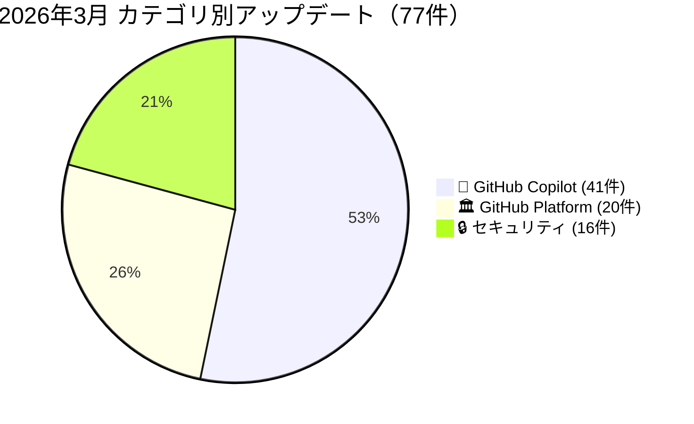
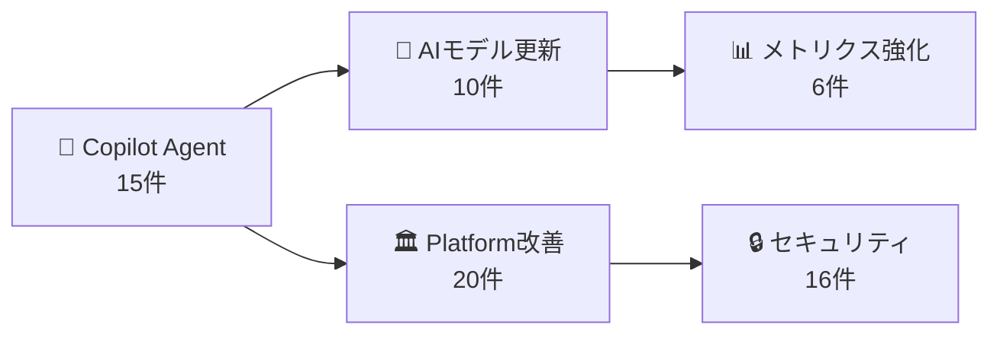

2026年3月のGitHub Changelogを振り返ります。合計**77件**のアップデートが公開され、GitHubプラットフォーム全体にわたる大規模な進化が見られた月となりました。

## 📊 月間アップデート概要

3月のアップデートの半数以上（53%）がGitHub Copilot関連であり、特に**Copilot Coding Agent（コーディングエージェント）の機能拡張**が最大のテーマでした。エージェントの15件のアップデートにより、PRの修正依頼、マージコンフリクトの解決、Jira連携、セマンティックコード検索など、開発ワークフロー全体をカバーするAIアシスタントへと進化しています。

---

## 🤖 GitHub Copilot（41件）

3月のCopilot関連アップデートは41件に達し、4つのテーマに大きく分類できます。

### Copilot Coding Agent の進化（15件）

3月最大のテーマは**Copilot Coding Agent**の急速な進化です。もはや単純なコード補完ツールではなく、開発ワークフロー全体をサポートするAIエージェントへと変貌を遂げています。

- **PRの変更対応**: `@copilot`をPRコメントでメンションするだけで、エージェントがコード変更を実行（3/24）
- **マージコンフリクト解決**: PRのマージコンフリクトを自動的に解決する機能が追加（3/26）
- **起動速度50%改善**: エージェントのセッション開始が大幅に高速化（3/19）
- **セマンティックコード検索**: コードベース全体の意味的な理解に基づく高速な検索が可能に（3/17）
- **Jira連携**: Jira CloudからCopilotエージェントにタスクを直接委任できるパブリックプレビューが開始（3/5）
- **セッションログの可視性向上**: エージェントのコミットからセッションログへのトレース、Raycastでのライブログ監視（3/20）
- **バリデーションツールの設定**: リポジトリレベルでエージェントの検証ツールをカスタマイズ可能に（3/18）
- **Actions ワークフロー承認のスキップ**: 管理者がエージェントのActionsワークフロー承認を省略するオプションを追加（3/13）

### AIモデルの更新（10件）

モデルエコシステムが大幅に拡充され、選択肢が増えました。

- **GPT-5.4 GA**: OpenAIの最新エージェントコーディングモデルが一般提供開始（3/5）
- **GPT-5.4 mini GA**: 軽量版も一般提供開始。Student プランでも利用可能に（3/17）
- **GPT-5.3-Codex LTS**: Copilot Business向けの長期サポートモデルプログラムを導入（3/18）
- **Gemini 3.1 Pro**: JetBrains IDE、Xcode、Eclipseでパブリックプレビュー開始（3/23）
- **Grok Code Fast 1**: xAIのモデルがCopilot Free の自動モデル選択に追加（3/4）
- **モデル非推奨化**: Gemini 3 ProとGPT-5.1シリーズの廃止予定を発表（3/2、3/26）
- **自動モデル選択**: 実際に使用されたモデルがメトリクスで確認可能に。JetBrains IDEでもGA（3/12、3/20）

### メトリクス・可観測性の強化（6件）

Copilotの利用状況を組織レベルで把握するための機能が着実に強化されています。

- **Plan Mode テレメトリ**: 計画モードの利用状況をメトリクスで追跡可能に（3/2）
- **CLI アクティビティ**: ユーザーレベル・組織レベルのCLI利用状況を追加（3/5、3/17）
- **エージェントユーザーの識別**: Coding Agentのアクティブユーザーをメトリクスで特定可能に（3/25）
- **Enterprise Managed Users**: EMU環境でのユーザー名の一貫性を確保（3/2）

### IDE統合の進化（4件）

- **VS Code v1.110**: エージェント機能の包括的な強化、ファイルエクスプローラーパネルの追加（3/6、3/11）
- **JetBrains**: コアエージェント機能がGAに昇格する大規模アップデート（3/11）
- **Copilot on Web**: ファイルエクスプローラーパネルを追加し、ブラウザ上でのリポジトリ探索が可能に（3/11）
- **Copilot Memory**: Pro/Pro+ユーザーでデフォルト有効化（パブリックプレビュー）（3/4）

---

## 🏛️ GitHub Platform（20件）

プラットフォーム全体にわたる改善が20件あり、Actions、Issues/Projects、モバイルの3つの領域で進化しています。

### GitHub Actions & Runners（6件）

- **Actions Runner Controller 0.14.0 GA**: KubernetesベースのランナーコントローラーがGAに到達。ノード選択のサポートなどを追加（3/19）
- **OIDC カスタムプロパティ対応**: OIDCトークンにリポジトリカスタムプロパティをクレームとして含められるように。RBAC設計の柔軟性が向上（3/12）
- **Agentic Workflow設定の可視化**: Actions実行サマリーでエージェントワークフローの設定を確認可能に（3/26）
- **セルフホステッドランナー**: 最小バージョン強制を一時停止（3/13）
- **Late March アップデート**: QoL改善を含む包括的なアップデート（3/19）

### Issues, Pull Requests & Projects（7件）

- **階層ビュー GA**: GitHub Projectsの階層ビューが一般提供開始。サブIssueの管理がより直感的に（3/19）
- **Issue Fields パブリックプレビュー**: 構造化されたIssueメタデータにより、ラベルに頼らない柔軟な管理が可能に（3/12）
- **PR ダッシュボード刷新**: 完全にリフレッシュされたPRダッシュボードのパブリックプレビュー（3/26）
- **マージステータスの即時確認**: PRのマージ状態をすばやく確認できる新機能（3/5）
- **サイドバイサイド表示**: PRのFiles changedページでコードとコメントを並べて表示（3/19）
- **コミットコメントの無効化**: リポジトリレベルで個別コミットへのコメントを制限可能に（3/25）

### その他

- **Codespaces データレジデンシー（日本）**: Codespacesのデータレジデンシーが日本リージョンでも利用可能に（3/19）
- **GitHub Mobile Android**: ナビゲーション体験の大幅な改善（3/20）
- **REST API 2026-03-10**: 初のカレンダーベースAPIバージョンをリリース（3/12）
- **コストセンター連携の非推奨化**: Enterprise PeopleページからのUI削除を予告（3/16）
- **使用量通知**: メータードプロダクトの使用量閾値に基づくメール通知を追加（3/3）

---

## 🔒 セキュリティ（16件）

セキュリティ関連では、Secret Scanning、Dependabot、CodeQL、Code Qualityの4つの柱で進化が見られます。

### Secret Scanning（4件）

- **パターン更新**: 3月のパターン更新は大規模な拡張で、対応するシークレットの種類が増加（3/10）
- **Push Protection 免除ルール**: ロール・チーム・アプリ単位での免除設定が可能に。リポジトリ設定からも管理可能に（3/17、3/23）
- **MCP Server連携**: GitHub MCP Serverを通じてAIコーディングエージェント内でもSecret Scanningが動作するように（3/17）

### Dependabot（3件）

- **npm マルウェア検出**: Dependabotがnpm依存関係のマルウェアを検出する機能を再始動（3/17）
- **pre-commit hooks 対応**: pre-commitフック設定ファイルの依存関係を自動更新するネイティブサポート（3/10）
- **アラート担当者 GA**: Dependabotアラートに担当者を割り当てる機能がGA（3/3）

### CodeQL（2件）

- **Java 26 サポート**: CodeQL 2.24.3でJava 26をサポート。その他の改善も含む（3/10）
- **インクリメンタル解析の高速化**: PRに対するCodeQLの増分解析が大幅に高速化（3/24）

### Code Quality & Advanced Security（4件）

- **バッチ適用**: Code QualityのPR上での品質提案を一括適用可能に（3/17）
- **Enterprise ポリシー**: Code QualityのポリシーをCode Securityから分離して独立管理（3/3）
- **Advanced Security セットアップ簡素化**: ガイド付きの合理化されたセットアップ体験を導入（3/17）
- **セキュリティマネージャーロール変更**: Code Quality権限をセキュリティマネージャーロールから削除（3/17）

---

## 🔍 3月のまとめ

2026年3月のGitHub Changelogは、**Copilot Coding Agentの本格的な実用化**を象徴する月でした。15件のエージェント関連アップデートにより、単なるコード補完から「開発ワークフロー全体を支援するAIパートナー」への進化が鮮明になっています。

特に注目すべきポイント：

1. **エージェントの自律性向上**: PR変更、マージコンフリクト解決、Jira連携など、人間の介入を最小限にする方向に進化
2. **マルチモデル戦略の加速**: GPT-5.4、Gemini 3.1 Pro、Grok Code Fast 1の追加と、旧モデルの積極的な非推奨化
3. **Enterprise向けガバナンス**: メトリクス、可観測性、ポリシー管理の強化により、組織レベルでのAI活用基盤が整備
4. **セキュリティの多層化**: Secret Scanning、Dependabot、CodeQL、Code Qualityのそれぞれで着実な進化

---

## 📋 全アップデート一覧

| 日付 | カテゴリ | タイトル | 概要 | Changelog |
|------|---------|---------|------|-----------|
| 3/30 | 🤖 | Create issues from Slack with Copilot | GitHub has released a new capability within the GitHub Slack app that allows use... | [原文](https://github.blog/changelog/2026-03-30-create-issues-from-slack-with-copilot) |
| 3/26 | 🏛️ | Agent activity in GitHub Issues and Projects | GitHub has released two generally available features that integrate coding agent... | [原文](https://github.blog/changelog/2026-03-26-agent-activity-in-github-issues-and-projects) |
| 3/26 | 🤖 | Ask @copilot to resolve merge conflicts on pull requests | GitHub's Copilot coding agent has gained the ability to resolve merge conflicts ... | [原文](https://github.blog/changelog/2026-03-26-ask-copilot-to-resolve-merge-conflicts-on-pull-requests) |
| 3/26 | 🔒 | Credential revocation API now supports GitHub OAuth and GitHub app credentials | GitHub has extended its Credential revocation API to support OAuth app tokens, G... | [原文](https://github.blog/changelog/2026-03-26-credential-revocation-api-now-supports-github-oauth-and-github-app-credentials) |
| 3/26 | 🏛️ | Custom images for GitHub-hosted runners are now generally available | GitHub has announced the general availability of custom images for GitHub-hosted... | [原文](https://github.blog/changelog/2026-03-26-custom-images-for-github-hosted-runners-are-now-generally-available) |
| 3/26 | 🤖 | Gemini 3 Pro deprecated | GitHub has deprecated Gemini 3 Pro across all GitHub Copilot experiences—includi... | [原文](https://github.blog/changelog/2026-03-26-gemini-3-pro-deprecated) |
| 3/26 | 🏛️ | New pull requests dashboard is in public preview | GitHub has launched a public preview of a completely refreshed pull requests das... | [原文](https://github.blog/changelog/2026-03-26-new-pull-requests-dashboard-is-in-public-preview) |
| 3/26 | 🏛️ | View Agentic Workflow configs in the Actions run summary | GitHub has added the ability to view Agentic Workflow markdown configuration fil... | [原文](https://github.blog/changelog/2026-03-26-view-agentic-workflow-configs-in-the-actions-run-summary) |
| 3/25 | 🤖 | Copilot usage metrics now identify active Copilot coding agent users | GitHub has extended its Copilot usage metrics API to surface a new per-user fiel... | [原文](https://github.blog/changelog/2026-03-25-copilot-usage-metrics-now-identify-active-copilot-coding-agent-users) |
| 3/25 | 🏛️ | Disable comments on individual commits | GitHub has introduced a new repository-level setting that allows admins to disab... | [原文](https://github.blog/changelog/2026-03-25-disable-comments-on-individual-commits) |
| 3/25 | 🤖 | GitHub Copilot for Jira — Public preview enhancements | GitHub has shipped a set of iterative enhancements to the GitHub Copilot coding ... | [原文](https://github.blog/changelog/2026-03-25-github-copilot-for-jira-public-preview-enhancements) |
| 3/25 | 🤖 | Updates to our Privacy Statement and Terms of Service: How we use your data | GitHub announced sweeping updates to its Privacy Statement and Terms of Service,... | [原文](https://github.blog/changelog/2026-03-25-updates-to-our-privacy-statement-and-terms-of-service-how-we-use-your-data) |
| 3/24 | 🤖 | Ask @copilot to make changes to a pull request | GitHub has expanded Copilot coding agent's capabilities to allow developers to m... | [原文](https://github.blog/changelog/2026-03-24-ask-copilot-to-make-changes-to-any-pull-request) |
| 3/24 | 🤖 | Ask @copilot to make changes to any pull request | GitHub has improved the Copilot coding agent to allow users to mention @copilot ... | [原文](https://github.blog/changelog/2026-03-24-ask-copilot-to-make-changes-to-any-pull-request) |
| 3/24 | 🔒 | Faster incremental analysis with CodeQL in pull requests | GitHub has significantly enhanced CodeQL's incremental analysis for pull request... | [原文](https://github.blog/changelog/2026-03-24-faster-incremental-analysis-with-codeql-in-pull-requests) |
| 3/24 | 🤖 | Manage Copilot coding agent repository access via the API | GitHub has introduced new REST APIs in public preview that allow organization ow... | [原文](https://github.blog/changelog/2026-03-24-manage-copilot-coding-agent-repository-access-via-the-api) |
| 3/24 | 🔒 | Upcoming deprecation of security-related organization API fields | GitHub is deprecating and removing seven security-related fields from the 'get a... | [原文](https://github.blog/changelog/2026-03-24-upcoming-deprecation-of-security-related-organization-api-fields) |
| 3/23 | 🤖 | Gemini 3.1 Pro is now available in JetBrains IDEs, Xcode, and Eclipse | Gemini 3.1 Pro, Google's large language model, is now available in public previe... | [原文](https://github.blog/changelog/2026-03-23-gemini-3-1-pro-is-now-available-in-jetbrains-ides-xcode-and-eclipse) |
| 3/23 | 🔒 | Push protection exemptions from repository settings | GitHub has extended the management surface for secret scanning push protection e... | [原文](https://github.blog/changelog/2026-03-23-push-protection-exemptions-from-repository-settings) |
| 3/20 | 🏛️ | A smoother navigation experience in GitHub Mobile for Android | GitHub has shipped a navigation overhaul for its Android mobile app, focusing on... | [原文](https://github.blog/changelog/2026-03-20-a-smoother-navigation-experience-in-github-mobile-for-android) |
| 3/20 | 🤖 | Copilot usage metrics now resolve auto model selection to actual models | GitHub has updated Copilot usage metrics so that activity previously reported un... | [原文](https://github.blog/changelog/2026-03-20-copilot-usage-metrics-now-resolve-auto-model-selection-to-actual-models) |
| 3/20 | 🤖 | Monitor Copilot coding agent logs live in Raycast | GitHub has added live log streaming for Copilot coding agent sessions directly w... | [原文](https://github.blog/changelog/2026-03-20-monitor-copilot-coding-agent-logs-live-in-raycast) |
| 3/20 | 🤖 | Trace any Copilot coding agent commit to its session logs | GitHub has introduced an `Agent-Logs-Url` trailer in commit messages created by ... | [原文](https://github.blog/changelog/2026-03-20-trace-any-copilot-coding-agent-commit-to-its-session-logs) |
| 3/19 | 🏛️ | Actions Runner Controller release 0.14.0 | GitHub Actions Runner Controller (ARC) 0.14.0 has reached general availability, ... | [原文](https://github.blog/changelog/2026-03-19-actions-runner-controller-release-0-14-0) |
| 3/19 | 🏛️ | Codespaces with data residency now available in Japan | GitHub Codespaces with data residency has expanded its regional availability to ... | [原文](https://github.blog/changelog/2026-03-19-codespaces-with-data-residency-now-available-in-japan) |
| 3/19 | 🤖 | Copilot coding agent now starts work 50% faster | GitHub has optimized the Copilot coding agent's startup sequence, achieving a 50... | [原文](https://github.blog/changelog/2026-03-19-copilot-coding-agent-now-starts-work-50-faster) |
| 3/19 | 🏛️ | GitHub Actions: Late March 2026 updates | GitHub Actions' late March 2026 update addresses two long-requested quality-of-l... | [原文](https://github.blog/changelog/2026-03-19-github-actions-late-march-2026-updates) |
| 3/19 | 🏛️ | Hierarchy view in GitHub Projects is now generally available | GitHub Projects' hierarchy view has reached general availability as of March 19,... | [原文](https://github.blog/changelog/2026-03-19-hierarchy-view-in-github-projects-is-now-generally-available) |
| 3/19 | 🤖 | More visibility into Copilot coding agent sessions | GitHub has shipped a set of UX improvements to Copilot coding agent's session lo... | [原文](https://github.blog/changelog/2026-03-19-more-visibility-into-copilot-coding-agent-sessions) |
| 3/19 | 🏛️ | View code and comments side-by-side in pull request Files changed page | GitHub is rolling out docked panels for the pull request 'Files changed' page, i... | [原文](https://github.blog/changelog/2026-03-19-view-code-and-comments-side-by-side-in-pull-request-files-changed-page) |
| 3/18 | 🤖 | Configure Copilot coding agent’s validation tools | GitHub has introduced repository-level configuration controls for the validation... | [原文](https://github.blog/changelog/2026-03-18-configure-copilot-coding-agents-validation-tools) |
| 3/18 | 🤖 | GPT-5.3-Codex long-term support in GitHub Copilot | GitHub has introduced a new Long-Term Support (LTS) model program for Copilot Bu... | [原文](https://github.blog/changelog/2026-03-18-gpt-5-3-codex-long-term-support-in-github-copilot) |
| 3/17 | 🔒 | Code Quality permissions removed from security manager role | GitHub has removed the ability for users with the security manager role to enabl... | [原文](https://github.blog/changelog/2026-03-17-code-quality-permissions-removed-from-security-manager-role) |
| 3/17 | 🤖 | Copilot coding agent works faster with semantic code search | GitHub has enhanced the Copilot coding agent by integrating a semantic code sear... | [原文](https://github.blog/changelog/2026-03-17-copilot-coding-agent-works-faster-with-semantic-code-search) |
| 3/17 | 🤖 | Copilot usage metrics now includes organization-level GitHub Copilot CLI activity | GitHub has added organization-level GitHub Copilot CLI activity tracking to its ... | [原文](https://github.blog/changelog/2026-03-17-copilot-usage-metrics-now-includes-organization-level-github-copilot-cli-activity) |
| 3/17 | 🔒 | Dependabot now detects malware in npm dependencies | GitHub has relaunched Dependabot's malware detection capability for npm dependen... | [原文](https://github.blog/changelog/2026-03-17-dependabot-now-detects-malware-in-npm-dependencies) |
| 3/17 | 🔒 | GitHub Advanced Security setup made simple | GitHub has introduced a streamlined guided setup experience for GitHub Advanced ... | [原文](https://github.blog/changelog/2026-03-17-github-advanced-security-setup-made-simple) |
| 3/17 | 🔒 | GitHub Code Quality: Batch apply quality suggestions on pull requests | GitHub Code Quality has introduced a batch apply feature that allows developers ... | [原文](https://github.blog/changelog/2026-03-17-github-code-quality-batch-apply-quality-suggestions-on-pull-requests) |
| 3/17 | 🏛️ | GitHub Enterprise Server 3.20 is now generally available | GitHub Enterprise Server (GHES) 3.20 has reached general availability, deliverin... | [原文](https://github.blog/changelog/2026-03-17-github-enterprise-server-3-20-is-now-generally-available) |
| 3/17 | 🤖 | GPT-5.4 mini is now generally available for GitHub Copilot | GPT-5.4 mini, OpenAI's latest compact variant of their agentic coding model GPT-... | [原文](https://github.blog/changelog/2026-03-17-gpt-5-4-mini-is-now-generally-available-for-github-copilot) |
| 3/17 | 🔒 | Push protection exemptions for roles, teams, and apps | GitHub has introduced the ability for organizations using secret scanning push p... | [原文](https://github.blog/changelog/2026-03-17-push-protection-exemptions-for-apps-teams-and-roles) |
| 3/17 | 🔒 | Secret scanning in AI coding agents via the GitHub MCP Server | GitHub has introduced secret scanning capabilities within AI coding agents throu... | [原文](https://github.blog/changelog/2026-03-17-secret-scanning-in-ai-coding-agents-via-the-github-mcp-server) |
| 3/16 | 🏛️ | Deprecating the cost center integration on the enterprise People page | GitHub is deprecating the cost center integration from the enterprise People pag... | [原文](https://github.blog/changelog/2026-03-16-deprecating-the-cost-center-integration-on-the-enterprise-people-page) |
| 3/13 | 🤖 | Optionally skip approval for Copilot coding agent Actions workflows | GitHub has added a new repository setting that allows administrators to skip the... | [原文](https://github.blog/changelog/2026-03-13-optionally-skip-approval-for-copilot-coding-agent-actions-workflows) |
| 3/13 | 🏛️ | Self-hosted runner minimum version enforcement paused | GitHub is temporarily pausing enforcement of the minimum self-hosted runner vers... | [原文](https://github.blog/changelog/2026-03-13-self-hosted-runner-minimum-version-enforcement-paused) |
| 3/13 | 🤖 | Updates to GitHub Copilot for students | GitHub has transitioned students with GitHub Education benefits to the new GitHu... | [原文](https://github.blog/changelog/2026-03-13-updates-to-github-copilot-for-students) |
| 3/12 | 🏛️ | Actions OIDC tokens now support repository custom properties | GitHub Actions OIDC tokens now support repository custom properties as claims, e... | [原文](https://github.blog/changelog/2026-03-12-actions-oidc-tokens-now-support-repository-custom-properties) |
| 3/12 | 🤖 | Copilot auto model selection is generally available in JetBrains IDEs | GitHub Copilot auto model selection is now generally available in JetBrains IDEs... | [原文](https://github.blog/changelog/2026-03-12-copilot-auto-model-selection-is-generally-available-in-jetbrains-ides) |
| 3/12 | 🏛️ | Issue fields: Structured issue metadata is in public preview | GitHub introduces Issue Fields, a public preview feature that replaces unstructu... | [原文](https://github.blog/changelog/2026-03-12-issue-fields-structured-issue-metadata-is-in-public-preview) |
| 3/12 | 🏛️ | REST API version 2026-03-10 is now available | GitHub has released REST API version 2026-03-10, the first calendar-based API ve... | [原文](https://github.blog/changelog/2026-03-12-rest-api-version-2026-03-10-is-now-available) |
| 3/11 | 🤖 | Explore a repository using Copilot on the web | GitHub has added a file explorer panel to Copilot Chat on the web, enabling deve... | [原文](https://github.blog/changelog/2026-03-11-explore-a-repository-using-copilot-on-the-web) |
| 3/11 | 🤖 | Major agentic capabilities improvements in GitHub Copilot for JetBrains IDEs | GitHub Copilot for JetBrains IDEs receives a major update that graduates core ag... | [原文](https://github.blog/changelog/2026-03-11-major-agentic-capabilities-improvements-in-github-copilot-for-jetbrains-ides) |
| 3/11 | 🤖 | Request Copilot code review from GitHub CLI | GitHub CLI v2.88.0 introduces native Copilot code review integration, allowing d... | [原文](https://github.blog/changelog/2026-03-11-request-copilot-code-review-from-github-cli) |
| 3/10 | 🔒 | CodeQL 2.24.3 adds Java 26 support and other improvements | CodeQL 2.24.3 is a maintenance release of GitHub's static analysis engine that a... | [原文](https://github.blog/changelog/2026-03-10-codeql-2-24-3-adds-java-26-support-and-other-improvements) |
| 3/10 | 🔒 | Dependabot now supports pre-commit hooks | GitHub Dependabot now natively supports automatic dependency updates for pre-com... | [原文](https://github.blog/changelog/2026-03-10-dependabot-now-supports-pre-commit-hooks) |
| 3/10 | 🔒 | Secret scanning pattern updates — March 2026 | GitHub's March 2026 secret scanning update is a substantial expansion of the pla... | [原文](https://github.blog/changelog/2026-03-10-secret-scanning-pattern-updates-march-2026) |
| 3/6 | 🤖 | Figma MCP server can now generate design layers from VS Code | The Figma MCP (Model Context Protocol) server integration with GitHub Copilot no... | [原文](https://github.blog/changelog/2026-03-06-figma-mcp-server-can-now-generate-design-layers-from-vs-code) |
| 3/6 | 🤖 | GitHub Copilot in Visual Studio Code v1.110 – February release | The VS Code February 2026 release (v1.110) delivers a comprehensive set of agent... | [原文](https://github.blog/changelog/2026-03-06-github-copilot-in-visual-studio-code-v1-110-february-release) |
| 3/5 | 🤖 | Add images to agent sessions | GitHub now supports adding images to Copilot agent sessions on github.com, enabl... | [原文](https://github.blog/changelog/2026-03-05-add-images-to-agent-sessions) |
| 3/5 | 🤖 | Copilot code review now runs on an agentic architecture | GitHub Copilot code review has transitioned from its previous architecture to a ... | [原文](https://github.blog/changelog/2026-03-05-copilot-code-review-now-runs-on-an-agentic-architecture) |
| 3/5 | 🤖 | Copilot usage metrics now includes user-level GitHub Copilot CLI activity | GitHub has expanded Copilot usage metrics to include user-level GitHub Copilot C... | [原文](https://github.blog/changelog/2026-03-05-copilot-usage-metrics-now-includes-user-level-github-copilot-cli-activity) |
| 3/5 | 🤖 | Discover and manage agent activity with new session filters | GitHub Enterprise AI Controls and agent control plane has been updated with addi... | [原文](https://github.blog/changelog/2026-03-05-discover-and-manage-agent-activity-with-new-session-filters) |
| 3/5 | 🤖 | GitHub Copilot coding agent for Jira is now in public preview | GitHub has launched a public preview integration that allows Jira Cloud users to... | [原文](https://github.blog/changelog/2026-03-05-github-copilot-coding-agent-for-jira-is-now-in-public-preview) |
| 3/5 | 🤖 | GPT-5.4 is generally available in GitHub Copilot | OpenAI's GPT-5.4, described as their latest agentic coding model, is now general... | [原文](https://github.blog/changelog/2026-03-05-gpt-5-4-is-generally-available-in-github-copilot) |
| 3/5 | 🏛️ | Hierarchy view improvements and file uploads in issue forms | GitHub has shipped three improvements to its Projects and Issues experience: hie... | [原文](https://github.blog/changelog/2026-03-05-hierarchy-view-improvements-and-file-uploads-in-issue-forms) |
| 3/5 | 🤖 | Pick a model for @copilot in pull request comments | GitHub now allows users to select a specific AI model when mentioning @copilot i... | [原文](https://github.blog/changelog/2026-03-05-pick-a-model-for-copilot-in-pull-request-comments) |
| 3/5 | 🏛️ | Quick access to merge status in pull requests is in public preview | GitHub is rolling out a public preview that surfaces the pull request merge stat... | [原文](https://github.blog/changelog/2026-03-05-quick-access-to-merge-status-in-pull-requests-in-public-preview) |
| 3/4 | 🤖 | Copilot Memory now on by default for Pro and Pro+ users in public preview | GitHub has flipped Copilot Memory from opt-in to on-by-default for all Copilot P... | [原文](https://github.blog/changelog/2026-03-04-copilot-memory-now-on-by-default-for-pro-and-pro-users-in-public-preview) |
| 3/4 | 🤖 | Grok Code Fast 1 is now available in Copilot Free auto model selection | xAI's Grok Code Fast 1 model has been added to the Copilot auto model selection ... | [原文](https://github.blog/changelog/2026-03-04-grok-code-fast-1-is-now-available-in-copilot-free-auto-model-selection) |
| 3/4 | 🔒 | Lock and unlock draft repository security advisories | GitHub now allows repository administrators to lock draft repository security ad... | [原文](https://github.blog/changelog/2026-03-04-lock-and-unlock-draft-repository-security-advisories) |
| 3/3 | 🔒 | Dependabot alert assignees are now generally available | Dependabot alert assignees have reached general availability, allowing users wit... | [原文](https://github.blog/changelog/2026-03-03-dependabot-alert-assignees-are-now-generally-available) |
| 3/3 | 🏛️ | Email notifications for included usage thresholds | GitHub now sends email notifications when included usage for metered products (A... | [原文](https://github.blog/changelog/2026-03-03-email-notifications-for-included-usage-thresholds) |
| 3/3 | 🔒 | GitHub Code Quality enterprise policy | GitHub has decoupled Code Quality policy management from Code Security within Gi... | [原文](https://github.blog/changelog/2026-03-03-github-code-quality-enterprise-policy) |
| 3/2 | 🤖 | Copilot metrics now includes plan mode | Copilot usage metrics now includes dedicated telemetry for plan mode, allowing e... | [原文](https://github.blog/changelog/2026-03-02-copilot-metrics-now-includes-plan-mode) |
| 3/2 | 🤖 | Copilot metrics reports now return consistent usernames for Enterprise Managed Users | GitHub Copilot usage metrics reports now return a consistent user_login value fo... | [原文](https://github.blog/changelog/2026-03-02-copilot-metrics-reports-now-return-consistent-usernames-for-enterprise-managed-users) |
| 3/2 | 🤖 | Network configuration changes for Copilot coding agent now in effect | GitHub has confirmed that previously announced network configuration changes for... | [原文](https://github.blog/changelog/2026-03-02-network-configuration-changes-for-copilot-coding-agent-now-in-effect) |
| 3/2 | 🤖 | Upcoming deprecation of Gemini 3 Pro and GPT-5.1 models | GitHub is deprecating five AI models across all Copilot experiences: Gemini 3 Pr... | [原文](https://github.blog/changelog/2026-03-02-upcoming-deprecation-of-gemini-3-pro-and-gpt-5-1-models) |