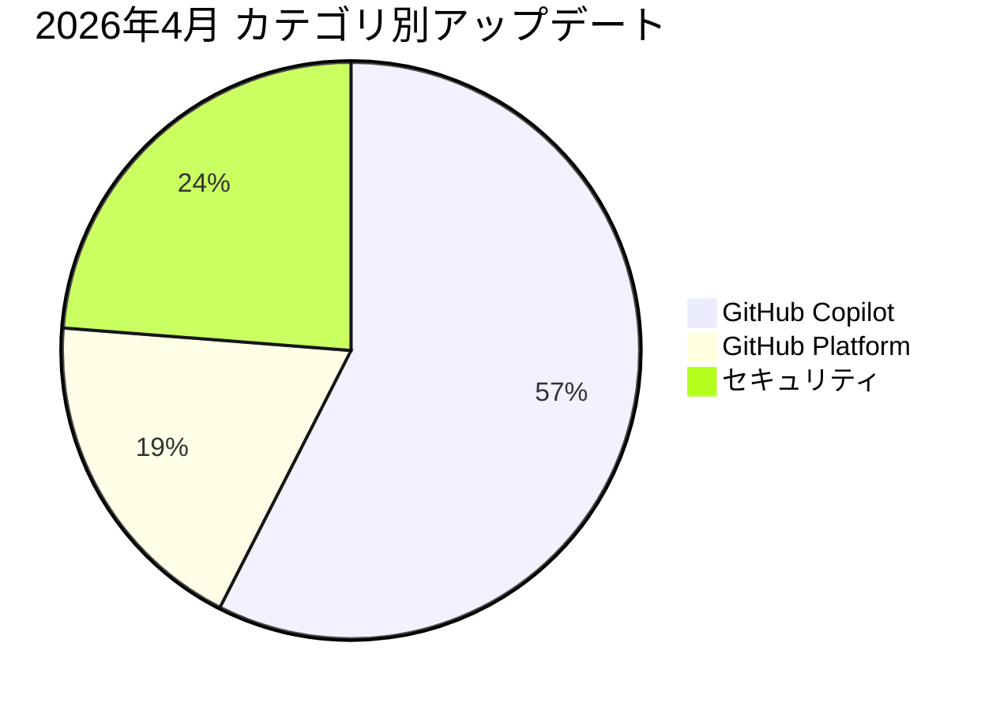

2026年4月の GitHub Changelog をまとめます。合計80件のアップデートがありました。

## 📊 月間アップデート概要

## 🤖 GitHub Copilot

GitHub Copilot 関連のアップデートが46件ありました。

## 🏛️ GitHub Platform

GitHub Platform 関連のアップデートが15件ありました。

## 🔒 セキュリティ

セキュリティ関連のアップデートが19件ありました。

## 📋 全アップデート一覧

| 日付 | カテゴリ | タイトル | 概要 | Changelog |
|------|---------|---------|------|-----------|
| 4/24 | 🏛️ | Changes to notification retention and archived repository watches | GitHub is making two retention-related policy changes that will roll out over th... | [原文](https://github.blog/changelog/2026-04-24-changes-to-notification-retention-and-archived-repository-watches) |
| 4/24 | 🤖 | GPT-5.5 is generally available for GitHub Copilot | OpenAI's GPT-5.5 model has reached general availability across GitHub Copilot, a... | [原文](https://github.blog/changelog/2026-04-24-gpt-5-5-is-generally-available-for-github-copilot) |
| 4/24 | 🤖 | Inline agent mode in preview and more in GitHub Copilot for JetBrains IDEs | This update delivers three headline features to GitHub Copilot for JetBrains IDE... | [原文](https://github.blog/changelog/2026-04-24-inline-agent-mode-in-preview-and-more-in-github-copilot-for-jetbrains-ides) |
| 4/24 | 🤖 | Notice about upcoming new format for GitHub App installation tokens | GitHub is migrating the format of GitHub App installation tokens from a 40-chara... | [原文](https://github.blog/changelog/2026-04-24-notice-about-upcoming-new-format-for-github-app-installation-tokens) |
| 4/23 | 🤖 | Better debugging with GitHub Copilot on the web | GitHub Copilot Chat on github.com now provides improved debugging assistance whe... | [原文](https://github.blog/changelog/2026-04-23-better-debugging-with-github-copilot-on-the-web) |
| 4/23 | 🤖 | Copilot Chat improvements for pull requests | GitHub Copilot Chat has received three new pull-request-focused abilities—unders... | [原文](https://github.blog/changelog/2026-04-23-copilot-chat-improvements-for-pull-requests) |
| 4/23 | 🤖 | Copilot cloud agent fields added to usage metrics | GitHub has added a new used_copilot_cloud_agent boolean field to the Copilot usa... | [原文](https://github.blog/changelog/2026-04-23-copilot-cloud-agent-fields-added-to-usage-metrics) |
| 4/23 | 🔒 | Dependabot-based dependency graphs for Python | GitHub now uses a new Dependabot job type to produce more complete and accurate ... | [原文](https://github.blog/changelog/2026-04-23-dependabot-graphs-for-python) |
| 4/23 | 🏛️ | Disable commit comments across your organization | GitHub now allows organization owners to disable commit comments across all repo... | [原文](https://github.blog/changelog/2026-04-23-disable-commit-comments-across-your-organization) |
| 4/23 | 🤖 | GitHub Copilot for Jira: Our latest enhancements | GitHub's Copilot for Jira integration receives five enhancements that deepen cus... | [原文](https://github.blog/changelog/2026-04-22-github-copilot-for-jira-our-latest-enhancements) |
| 4/23 | 🏛️ | Global pull requests dashboard moves to opt-out public preview | GitHub's redesigned global pull requests dashboard — first released as an opt-in... | [原文](https://github.blog/changelog/2026-04-23-global-pull-requests-dashboard-moves-to-opt-out-public-preview) |
| 4/23 | 🤖 | Pausing new self-serve signups for GitHub Copilot Business | GitHub is pausing new self-serve signups for Copilot Business for organizations ... | [原文](https://github.blog/changelog/2026-04-22-pausing-new-self-serve-signups-for-github-copilot-business) |
| 4/23 | 🤖 | View and manage agent sessions from issues and projects | GitHub now surfaces cloud agent sessions directly within the Issues and Projects... | [原文](https://github.blog/changelog/2026-04-23-view-and-manage-agent-sessions-from-issues-and-projects) |
| 4/22 | 🤖 | Bring your own language model key in VS Code now available | GitHub has made bring-your-own-language-model-key (BYOK) generally available for... | [原文](https://github.blog/changelog/2026-04-22-bring-your-own-language-model-key-in-vs-code-now-available) |
| 4/22 | 🤖 | C++ code intelligence for GitHub Copilot CLI in public preview | GitHub is shipping the Microsoft C++ Language Server as a public preview npm pac... | [原文](https://github.blog/changelog/2026-04-22-c-code-intelligence-for-github-copilot-cli-in-public-preview) |
| 4/22 | 🤖 | Copilot code review user counts now aggregate in usage metrics API | The Copilot usage metrics API now exposes six new aggregate fields that break do... | [原文](https://github.blog/changelog/2026-04-22-copilot-code-review-user-counts-now-aggregate-in-usage-metrics-api) |
| 4/22 | 🏛️ | GitHub CLI: Opt-out usage telemetry | Starting with v2.91.0, GitHub CLI introduces opt-out pseudonymous usage telemetr... | [原文](https://github.blog/changelog/2026-04-22-github-cli-opt-out-usage-telemetry) |
| 4/22 | 🤖 | Upcoming change to Copilot usage metrics report download URLs | GitHub is migrating the download URLs for Copilot usage metrics reports from inf... | [原文](https://github.blog/changelog/2026-04-22-upcoming-change-to-copilot-usage-metrics-report-download-urls) |
| 4/21 | 🔒 | CodeQL now supports sanitizers and validators in models-as-data | CodeQL now lets users define custom sanitizers and validators declaratively usin... | [原文](https://github.blog/changelog/2026-04-21-codeql-now-supports-sanitizers-and-validators-in-models-as-data) |
| 4/21 | 🔒 | Deprecation of security-related organization API fields | GitHub has deprecated seven security-enablement fields from the Get an Organizat... | [原文](https://github.blog/changelog/2026-04-21-deprecation-of-security-related-organization-api-fields) |
| 4/20 | 🤖 | Changes to GitHub Copilot plans for individuals | GitHub announced three simultaneous restrictions to its individual Copilot plans... | [原文](https://github.blog/changelog/2026-04-20-changes-to-github-copilot-plans-for-individuals) |
| 4/20 | 🏛️ | Sunsetting SHA-1 in HTTPS on GitHub | GitHub is removing SHA-1 from all HTTPS connections to github.com, GitHub Enterp... | [原文](https://github.blog/changelog/2026-04-20-sunsetting-sha-1-in-https-on-github) |
| 4/17 | 🤖 | GitHub Copilot CLI now supports Copilot auto model selection | GitHub Copilot CLI now supports Copilot auto model selection as a generally avai... | [原文](https://github.blog/changelog/2026-04-17-github-copilot-cli-now-supports-copilot-auto-model-selection) |
| 4/16 | 🤖 | Claude Opus 4.7 is generally available | Claude Opus 4.7, Anthropic's latest flagship Opus model, is now generally availa... | [原文](https://github.blog/changelog/2026-04-16-claude-opus-4-7-is-generally-available) |
| 4/16 | 🤖 | Manage agent skills with GitHub CLI | GitHub has launched `gh skill`, a new GitHub CLI command (v2.90.0+) that provide... | [原文](https://github.blog/changelog/2026-04-16-manage-agent-skills-with-github-cli) |
| 4/16 | 🏛️ | Rule insights dashboard and unified filter bar | GitHub has introduced a new rule insights dashboard and a unified filter bar acr... | [原文](https://github.blog/changelog/2026-04-16-rule-insights-dashboard-and-unified-filter-bar) |
| 4/15 | 🔒 | CodeQL 2.25.2 adds Kotlin 2.3.20 support and other updates | CodeQL 2.25.2 is an incremental improvement release for GitHub's static analysis... | [原文](https://github.blog/changelog/2026-04-15-codeql-2-25-2-adds-kotlin-2-3-20-support-and-other-updates) |
| 4/15 | 🤖 | Enable Copilot cloud agent via custom properties | Enterprise admins and AI managers can now selectively enable GitHub Copilot clou... | [原文](https://github.blog/changelog/2026-04-15-enable-copilot-cloud-agent-via-custom-properties) |
| 4/14 | 🔒 | Dependabot and code scanning: Org-level private registries | GitHub has removed the restriction that limited organizations to a single privat... | [原文](https://github.blog/changelog/2026-04-14-dependabot-and-code-scanning-org-level-private-registries) |
| 4/14 | 🔒 | Deployment context in repository properties and alerts | GitHub has released two generally available features that bring deployment conte... | [原文](https://github.blog/changelog/2026-04-14-deployment-context-in-repository-properties-and-alerts) |
| 4/14 | 🔒 | GitHub Code Quality: Improvements to standard findings in public preview | GitHub has shipped three usability improvements to the standard findings page wi... | [原文](https://github.blog/changelog/2026-04-14-github-code-quality-improvements-to-standard-findings-in-public-preview) |
| 4/14 | 🔒 | Link code scanning alerts to GitHub Issues | GitHub has introduced the ability to link code scanning alerts directly to GitHu... | [原文](https://github.blog/changelog/2026-04-14-link-code-scanning-alerts-to-github-issues) |
| 4/14 | 🤖 | Model selection for Claude and Codex agents on github.com | GitHub has expanded model selection capabilities to the Claude (Anthropic) and C... | [原文](https://github.blog/changelog/2026-04-14-model-selection-for-claude-and-codex-agents-on-github-com) |
| 4/14 | 🔒 | OIDC support for Dependabot and code scanning | Dependabot and code scanning now support OpenID Connect (OIDC) authentication fo... | [原文](https://github.blog/changelog/2026-04-14-oidc-support-for-dependabot-and-code-scanning) |
| 4/14 | 🔒 | SBOM exports are now computed asynchronously | GitHub has fundamentally rearchitected its Software Bill of Materials (SBOM) exp... | [原文](https://github.blog/changelog/2026-04-14-sbom-exports-are-now-computed-asynchronously) |
| 4/14 | 🔒 | Secret scanning pattern updates and product improvements | GitHub's April 14, 2026 secret scanning update delivers a broad set of improveme... | [原文](https://github.blog/changelog/2026-04-14-secret-scanning-pattern-updates-and-product-improvements) |
| 4/13 | 🤖 | Copilot data residency in US + EU and FedRAMP compliance now available | GitHub Copilot now offers formal data residency guarantees for US and EU regions... | [原文](https://github.blog/changelog/2026-04-13-copilot-data-residency-in-us-eu-and-fedramp-compliance-now-available) |
| 4/13 | 🤖 | Fix merge conflicts in three clicks with Copilot cloud agent | GitHub has introduced a streamlined 'Fix with Copilot' button on github.com that... | [原文](https://github.blog/changelog/2026-04-13-fix-merge-conflicts-in-three-clicks-with-copilot-cloud-agent) |
| 4/13 | 🤖 | Remote control CLI sessions on web and mobile in public preview | GitHub has launched a public preview of remote control capabilities for the Copi... | [原文](https://github.blog/changelog/2026-04-13-remote-control-cli-sessions-on-web-and-mobile-in-public-preview) |
| 4/10 | 🏛️ | Actions workflows are limited to 50 reruns | GitHub has imposed a hard cap of 50 reruns on any given Actions workflow run, ef... | [原文](https://github.blog/changelog/2026-04-10-actions-workflows-are-limited-to-50-reruns) |
| 4/10 | 🤖 | Copilot CLI activity now included in usage metrics totals and feature breakdowns | GitHub has integrated Copilot CLI activity data into the existing top-level tota... | [原文](https://github.blog/changelog/2026-04-10-copilot-cli-activity-now-included-in-usage-metrics-totals-and-feature-breakdowns) |
| 4/10 | 🤖 | Copilot cloud agent’s validation tools are now 20% faster | GitHub has improved the performance of Copilot cloud agent's built-in validation... | [原文](https://github.blog/changelog/2026-04-10-copilot-cloud-agents-validation-tools-are-now-20-faster) |
| 4/10 | 🤖 | Copilot usage metrics now aggregate Copilot cloud agent active user counts | GitHub has expanded the Copilot usage metrics API to include three new aggregate... | [原文](https://github.blog/changelog/2026-04-10-copilot-usage-metrics-now-aggregate-copilot-cloud-agent-active-user-counts) |
| 4/10 | 🤖 | Enforcing new limits and retiring Opus 4.6 Fast from Copilot Pro+ | GitHub is introducing two tiers of rate limits for Copilot—service-wide reliabil... | [原文](https://github.blog/changelog/2026-04-10-enforcing-new-limits-and-retiring-opus-4-6-fast-from-copilot-pro) |
| 4/10 | 🤖 | Pausing new GitHub Copilot Pro trials | GitHub is pausing new free trial sign-ups for Copilot Pro due to a significant r... | [原文](https://github.blog/changelog/2026-04-10-pausing-new-github-copilot-pro-trials) |
| 4/9 | 🤖 | Ask Copilot in security assessments now available | GitHub now embeds a Copilot conversational experience directly within the secret... | [原文](https://github.blog/changelog/2026-04-09-ask-copilot-in-security-assessments-now-available) |
| 4/9 | 🏛️ | New Low Quality option in the Hide comment menu | GitHub has added a new 'Low Quality' classification option to the Hide comment d... | [原文](https://github.blog/changelog/2026-04-09-new-low-quality-option-in-the-hide-comment-menu) |
| 4/9 | 🏛️ | New Sort by control added to Notifications | GitHub has introduced a new 'Sort by' control on the Notifications page, allowin... | [原文](https://github.blog/changelog/2026-04-09-new-sort-by-control-added-to-notifications) |
| 4/9 | 🏛️ | Release information in issue sidebar and default values for project fields | GitHub has shipped a multi-feature improvement to Projects and Issues that intro... | [原文](https://github.blog/changelog/2026-04-09-release-info-in-issue-sidebar-and-project-defaults) |
| 4/9 | 🏛️ | Repository member role labels now in pull request list view | GitHub has shipped a UI improvement that surfaces repository member role labels ... | [原文](https://github.blog/changelog/2026-04-09-repository-member-role-labels-now-in-pull-request-list-view) |
| 4/8 | 🔒 | Code Security risk assessment available for organizations | GitHub has released a free Code Security risk assessment feature that allows org... | [原文](https://github.blog/changelog/2026-04-08-code-security-risk-assessment-available-for-organizations) |
| 4/8 | 🤖 | Copilot-reviewed pull request merge metrics now in the usage metrics API | GitHub has expanded the Copilot usage metrics API with two new metrics—`pull_req... | [原文](https://github.blog/changelog/2026-04-08-copilot-reviewed-pull-request-merge-metrics-now-in-the-usage-metrics-api) |
| 4/8 | 🤖 | GitHub Copilot in Visual Studio Code, March Releases | GitHub Copilot in VS Code's March 2026 releases (v1.111–v1.115) represent a subs... | [原文](https://github.blog/changelog/2026-04-08-github-copilot-in-visual-studio-code-march-releases) |
| 4/8 | 🤖 | GitHub Mobile: Research and code with Copilot cloud agent anywhere | GitHub has expanded Copilot cloud agent capabilities on GitHub Mobile beyond pul... | [原文](https://github.blog/changelog/2026-04-08-github-mobile-research-and-code-with-copilot-cloud-agent-anywhere) |
| 4/8 | 🏛️ | New PGP signing key for GitHub CLI Linux packages | GitHub has published an updated PGP keyring for GitHub CLI (gh) Linux package re... | [原文](https://github.blog/changelog/2026-04-08-new-pgp-signing-key-for-github-cli-linux-packages) |
| 4/8 | 🔒 | Secret scanning improvements to alert APIs, webhooks, and delegated workflows | GitHub has rolled out a bundle of developer-experience improvements to its secre... | [原文](https://github.blog/changelog/2026-04-08-secret-scanning-improvements-to-alert-apis-webhooks-and-delegated-workflows) |
| 4/7 | 🔒 | Code scanning: Batch apply security alert suggestions on pull requests | GitHub has shipped a generally available improvement to code scanning on pull re... | [原文](https://github.blog/changelog/2026-04-07-code-scanning-batch-apply-security-alert-suggestions-on-pull-requests) |
| 4/7 | 🤖 | Copilot CLI now supports BYOK and local models | GitHub Copilot CLI has introduced support for Bring Your Own Key (BYOK) model pr... | [原文](https://github.blog/changelog/2026-04-07-copilot-cli-now-supports-byok-and-local-models) |
| 4/7 | 🔒 | Dependabot alerts are now assignable to AI agents for remediation | GitHub now allows Dependabot alerts to be directly assigned to AI coding agents—... | [原文](https://github.blog/changelog/2026-04-07-dependabot-alerts-are-now-assignable-to-ai-agents-for-remediation) |
| 4/7 | 🔒 | Dependabot version updates now support the Nix ecosystem | Dependabot has expanded its ecosystem coverage to include Nix flakes, enabling a... | [原文](https://github.blog/changelog/2026-04-07-dependabot-version-updates-now-support-the-nix-ecosystem) |
| 4/7 | 🔒 | npm trusted publishing now supports CircleCI | npm trusted publishing has expanded to support CircleCI as its third OIDC-based ... | [原文](https://github.blog/changelog/2026-04-06-npm-trusted-publishing-now-supports-circleci) |
| 4/7 | 🔒 | Prioritize security alerts with runtime context from Dynatrace | GitHub has launched a generally available integration that brings Dynatrace runt... | [原文](https://github.blog/changelog/2026-04-07-prioritize-security-alerts-with-runtime-context-from-dynatrace) |
| 4/6 | 🤖 | Copilot usage metrics now identify active and passive Copilot code review users | GitHub has expanded its Copilot usage metrics API to distinguish between active ... | [原文](https://github.blog/changelog/2026-04-06-copilot-usage-metrics-now-identify-active-and-passive-copilot-code-review-users) |
| 4/3 | 🤖 | Copilot cloud agent signs its commits | GitHub's Copilot cloud agent now cryptographically signs every commit it creates... | [原文](https://github.blog/changelog/2026-04-03-copilot-cloud-agent-signs-its-commits) |
| 4/3 | 🤖 | GPT-5.1 Codex, GPT-5.1-Codex-Max, and GPT-5.1-Codex-Mini deprecated | GitHub has deprecated three GPT-5.1 Codex model variants — GPT-5.1-Codex, GPT-5.... | [原文](https://github.blog/changelog/2026-04-03-gpt-5-1-codex-gpt-5-1-codex-max-and-gpt-5-1-codex-mini-deprecated) |
| 4/3 | 🤖 | Organization firewall settings for Copilot cloud agent | GitHub has introduced organization-level firewall settings for Copilot cloud age... | [原文](https://github.blog/changelog/2026-04-03-organization-firewall-settings-for-copilot-cloud-agent) |
| 4/3 | 🤖 | Organization runner controls for Copilot cloud agent | GitHub has released organization-level runner controls for Copilot cloud agent, ... | [原文](https://github.blog/changelog/2026-04-03-organization-runner-controls-for-copilot-cloud-agent) |
| 4/2 | 🤖 | Copilot organization custom instructions are generally available | GitHub Copilot organization custom instructions have reached general availabilit... | [原文](https://github.blog/changelog/2026-04-02-copilot-organization-custom-instructions-are-generally-available) |
| 4/2 | 🤖 | Copilot SDK in public preview | GitHub has released the Copilot SDK in public preview, providing developers with... | [原文](https://github.blog/changelog/2026-04-02-copilot-sdk-in-public-preview) |
| 4/2 | 🤖 | Copilot usage metrics now includes per-user GitHub Copilot CLI activity in organization reports | This changelog entry announces the final installment in a four-part rollout of G... | [原文](https://github.blog/changelog/2026-04-02-copilot-usage-metrics-now-includes-per-user-github-copilot-cli-activity-in-organization-reports) |
| 4/2 | 🏛️ | GitHub Actions: Early April 2026 updates | GitHub Actions' Early April 2026 update delivers three distinct improvements spa... | [原文](https://github.blog/changelog/2026-04-02-github-actions-early-april-2026-updates) |
| 4/2 | 🤖 | GitHub Copilot in Visual Studio — March update | The March 2026 update for GitHub Copilot in Visual Studio introduces a substanti... | [原文](https://github.blog/changelog/2026-04-02-github-copilot-in-visual-studio-march-update) |
| 4/2 | 🏛️ | Improved search for GitHub Issues is now generally available | GitHub's improved semantic search for Issues has graduated from public preview t... | [原文](https://github.blog/changelog/2026-04-02-improved-search-for-github-issues-is-now-generally-available) |
| 4/2 | 🔒 | The Security tab is now Security & quality | GitHub has renamed the top-level 'Security' tab to 'Security & quality' across r... | [原文](https://github.blog/changelog/2026-04-02-the-security-tab-is-now-security-quality) |
| 4/1 | 🏛️ | Codespaces is now generally available for GitHub Enterprise with data residency | GitHub Codespaces has reached general availability for GitHub Enterprise Cloud w... | [原文](https://github.blog/changelog/2026-04-01-codespaces-is-now-generally-available-for-github-enterprise-with-data-residency) |
| 4/1 | 🤖 | GitHub Mobile: Faster, more flexible agent assignment from issues | GitHub Mobile has introduced a new 'Assign an Agent' option accessible from the ... | [原文](https://github.blog/changelog/2026-04-01-github-mobile-faster-more-flexible-agent-assignment-from-issues) |
| 4/1 | 🤖 | GitHub Mobile: Stay in flow with a refreshed Copilot tab and native session logs | GitHub Mobile has received a significant update focused on managing Copilot agen... | [原文](https://github.blog/changelog/2026-04-01-github-mobile-stay-in-flow-with-a-refreshed-copilot-tab-and-native-session-logs) |
| 4/1 | 🤖 | GPT-5.4 mini is now available in Copilot Student auto model selection | GitHub has made GPT-5.4 mini generally available to users on the Copilot Student... | [原文](https://github.blog/changelog/2026-04-01-gpt-5-4-mini-is-now-available-in-copilot-student-auto-model-selection) |
| 4/1 | 🤖 | Research, plan, and code with Copilot cloud agent | GitHub has significantly expanded Copilot cloud agent (renamed from 'Copilot cod... | [原文](https://github.blog/changelog/2026-04-01-research-plan-and-code-with-copilot-cloud-agent) |
| 4/1 | 🤖 | Upcoming deprecation of Claude Sonnet 4 in GitHub Copilot | GitHub is deprecating Claude Sonnet 4 across all GitHub Copilot experiences—incl... | [原文](https://github.blog/changelog/2026-03-31-upcoming-deprecation-of-claude-sonnet-4-in-github-copilot) |