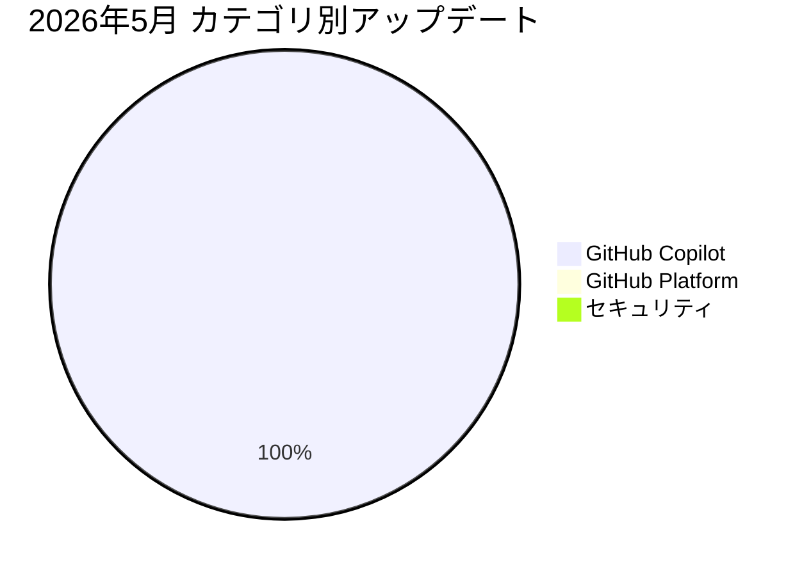

2026年5月の GitHub Changelog をまとめます。合計1件のアップデートがありました。

## 📊 月間アップデート概要

## 🤖 GitHub Copilot

GitHub Copilot 関連のアップデートが1件ありました。

## 🏛️ GitHub Platform

GitHub Platform 関連のアップデートが0件ありました。

## 🔒 セキュリティ

セキュリティ関連のアップデートが0件ありました。

## 📋 全アップデート一覧

| 日付 | カテゴリ | タイトル | 概要 | Changelog |
|------|---------|---------|------|-----------|
| 5/1 | 🤖 | Upcoming deprecation of GPT-5.2 and GPT-5.2-Codex | GitHub will deprecate GPT-5.2 and GPT-5.2-Codex across all Copilot experiences o... | [原文](https://github.blog/changelog/2026-05-01-upcoming-deprecation-of-gpt-5-2-and-gpt-5-2-codex) |