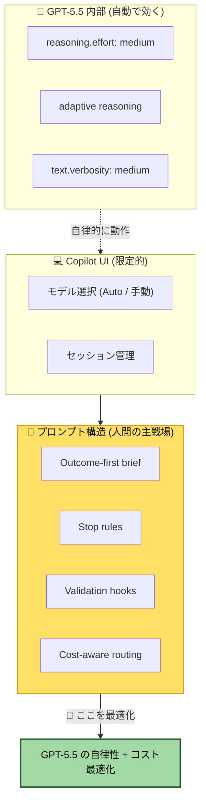
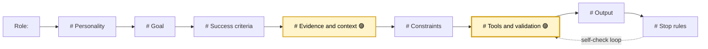
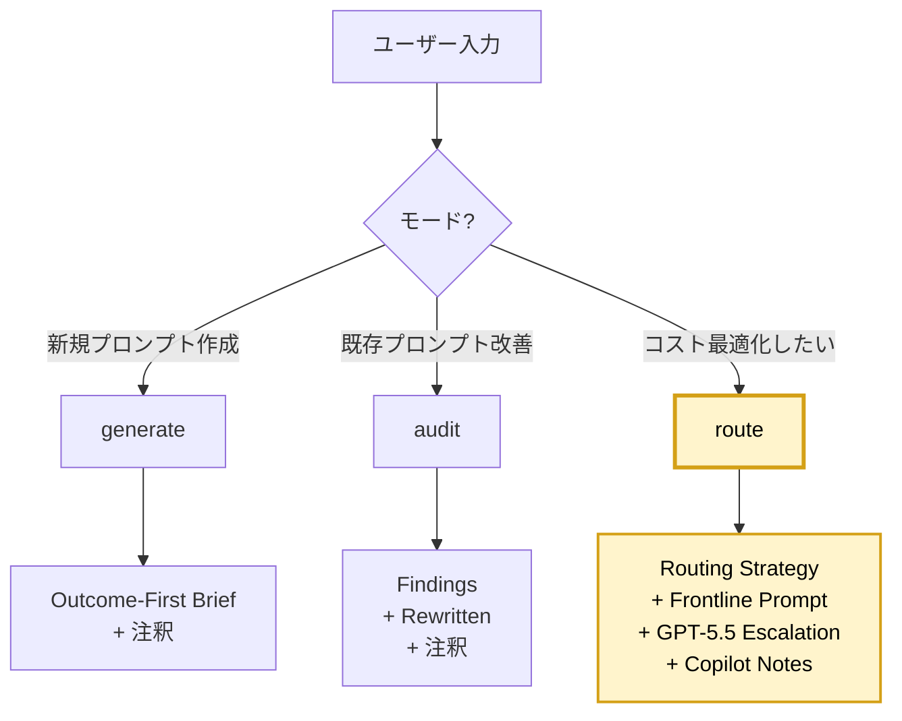
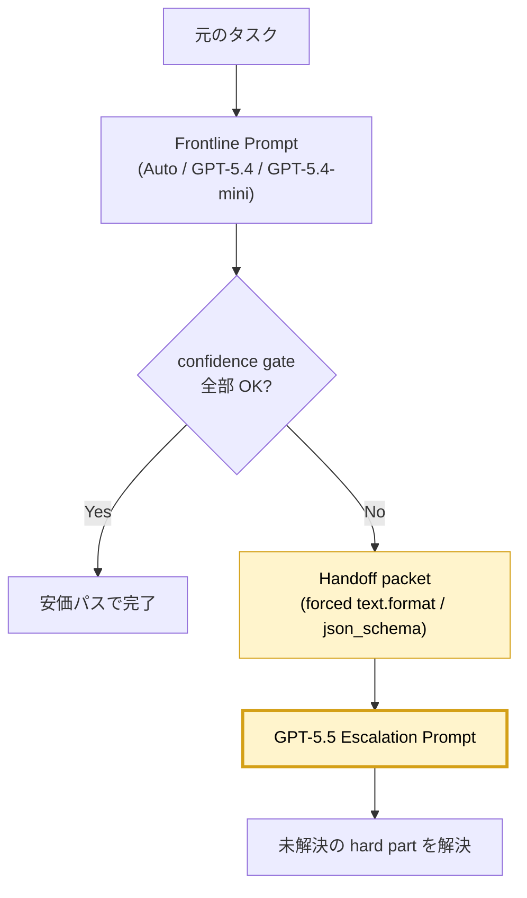

## はじめに

少し前に、GitHub Copilot から **Claude Opus 4.7** を使うときに「モデルが変われば指示も変わる」というテーマで記事を書きました ([モデルが変われば指示も変わる ─ Opus 4.7 向け Agent Skill を作った](./opus-4-7-prompt-design-copilot-skill))。そこで作った [`claude-prompt-optimizer`](https://github.com/shinyay/claude-prompt-optimizer) は、4.7 の特性を踏まえた「**5 スロットブリーフ**」を Agent Skill として再利用できるようにしたものでした。

今度は同じ問題を、**OpenAI GPT-5.5** で考えます。

GPT-5.5 にも公式の [GPT-5.5 prompting guide](https://developers.openai.com/api/docs/guides/prompt-guidance?model=gpt-5.5) があります。読んでみると、Claude 4.6 → 4.7 のとき以上に「型」が必要だと感じました。

それは、GPT-5.5 では **3 つ目の軸** ─ **コスト** ─ が大きく効いてくるからです。

- GPT-5.5 は強力な reasoning モデル
- 強力ゆえに、安易に呼び出すと **invisible reasoning tokens** がコストを押し上げる
- 一方で、`gpt-5.4` / `gpt-5.4-mini` のような安価モデルが GPT-5 系に揃っている
- さらに GitHub Copilot には **Auto モデル選択**もある
- つまり、「**全部 GPT-5.5 に投げる**」のは品質的にも経済的にも最適ではない

ここで欲しくなるのは、Claude 側で作ったような単純な「型生成」だけではありません。**「どこで安価モデルに任せて、どこで GPT-5.5 にエスカレーションするか」のルートそのものをプロンプトに組み込む** 仕組みが必要になります。

そうして作ったのが [`gpt-prompt-optimizer`](https://github.com/shinyay/gpt-prompt-optimizer) です。Claude 側と同じ Agent Skill 形式を採りつつ、新しく **`route` モード**を加えて、コスト最適化のルーティング戦略までプロンプトに落とし込めるようにしています。

この記事では以下の 5 点を共有します。

1. **なぜ GPT-5.5 で型が必要なのか** ─ OpenAI の公式知見と GitHub Copilot からの現実
2. **Outcome-First GPT-5.5 Brief** ─ 公式の 7 セクション + リポジトリの 2 拡張
3. **3 モード設計 (generate / audit / `route`)** ─ Claude 側の 2 モードに対する差分
4. **`route` モードの中身** ─ 安価モデル first → GPT-5.5 escalation のルーティング戦略
5. **設計の勘所と限界** ─ rubber-duck で 19+4 件の指摘を直した話

> 💡 この記事は **GitHub Copilot から GPT-5.5 を使うこと** を前提にしています。OpenAI の SDK 直接利用 (Responses API / Messages 系) も対象に含みますが、対話 UI として Copilot Chat / Copilot CLI を主に想定しています。

---

## GPT-5.5 で何が変わったのか

### モデル側の特徴 (vs GPT-5 系)

OpenAI の [GPT-5.5 prompting guide](https://developers.openai.com/api/docs/guides/prompt-guidance?model=gpt-5.5) と [Reasoning models](https://developers.openai.com/api/docs/guides/reasoning) を読み込んで、GPT-5.5 がどう変わったかを整理します。

| 観点 | GPT-5 系 (5.4 / 5.4-mini など) | GPT-5.5 |
|---|---|---|
| **デフォルト reasoning effort** | モデル依存 | **`medium`** (公式推奨の出発点) |
| **デフォルト text.verbosity** | 制御なし | **`medium`** (`low` で簡潔出力) |
| **推奨 API surface** | Chat Completions も可 | **Responses API** が new project の推奨 |
| **JSON 強制出力** | response_format / 旧形式 | **`text.format` の `json_schema`** (Structured Outputs) |
| **Reasoning tokens** | あり | あり (より効率的; `reasoning_tokens` を usage で確認可能) |
| **API state 管理** | 手動管理 | **`previous_response_id`** で簡潔に継続 |
| **assistant `phase` 値** | GPT-5.4 から `phase: "commentary"` / `phase: "final_answer"` を `previous_response_id` 連携の長時間タスクに利用可能 | 同パターンを GPT-5.5 でも継続。手動 replay 時に `phase` を保存することが特に重要 |

GPT-5.5 自体は GPT-5 系の延長にありますが、prompting guide が示す **「指示の出し方そのもの」のシフト** が一番大きい変化です。

### 公式が示すメンタルモデル

GPT-5.5 prompting guide の冒頭にこう書かれています。

> "GPT-5.5 works best when prompts define the outcome and leave room for the model to choose an efficient solution path."
>
> （GPT-5.5 は、プロンプトが**目的を定義し、モデルが効率の良い解法を選ぶ余地を残す**形で書かれているとき、もっとも力を発揮する）

そしてもう一つ、強い表現があります。

> "Avoid carrying over every instruction from an older prompt stack. Legacy prompts often over-specify the process because earlier models needed more help staying on track."
>
> （古いプロンプトスタックの命令を全部持ち越そうとしないこと。古いモデルは脱線しがちだったため、レガシープロンプトは過剰に手順を指定していることが多い）

整理すると、GPT-5.5 のメンタルモデルは次の 2 つに集約されます。

1. **Outcome-first** ─ 何が「ゴール」か、何が「成功条件」かを最初に決め、手順は委ねる
2. **Decision rules over absolutes** ─ `ALWAYS` / `NEVER` / `MUST` / `ONLY` のような絶対指示は本当に必要なところだけに使う。判断が伴うところは「これが起きたらこうする」という決定ルールに置き換える

「丁寧にステップを書き下す」は、GPT-5.5 では **逆効果** になりやすい、と公式が明言しているわけです。

### GitHub Copilot ユーザーから見たレバー

ここからが Claude 4.7 のときと同じ構図になります。**OpenAI の推奨レバーのうち、Copilot から触れるものは限られます**。

| OpenAI の推奨 | Copilot から触れるか | 我々の対応 |
|---|---|---|
| `reasoning.effort: medium` をデフォルトに | ❌ Copilot UI では選べない | **意識不要** (既定で動作) |
| `text.verbosity` の制御 | ❌ UI では選べない | プロンプトで「簡潔に」「N 文字で」と書く |
| Responses API への移行 | ❌ Copilot 側で抽象化済み | OpenAI SDK 直接利用時にだけ意識 |
| Structured Outputs (`text.format`) | ❌ Copilot は内部的に処理 | API ハーネス側で意識 |
| 新トークナイザー / reasoning tokens | ❌ ユーザー制御不可 | コスト感の知識として持つ |
| **Outcome-first で書く** | ✅ プロンプト構造そのもの | 🔑 主戦場 |
| **Stop rules を渡す** | ✅ プロンプト構造そのもの | 🔑 ループ抑止 |
| **Validation を渡す** | ✅ プロンプト構造そのもの | 🔑 self-check の駆動 |
| **コスト最適なモデル選択** | ✅ Auto / 手動切替 | 🔑 route モードの主戦場 |



Claude 4.7 のときと違うのは、「主戦場」に **`Cost-aware routing`** という 4 つ目のアイテムが加わっていることです。これが本記事の中核になります。

> 💡 **ポイント**: Copilot ユーザーが触れるレバーは「プロンプト構造」と「モデル選択」の 2 つだけ。前者を Outcome-First Brief で型化し、後者を `route` モードで明示化するのが本スキルの狙いです。

---

## Outcome-First GPT-5.5 Brief

### OpenAI 公式の 7 セクション

GPT-5.5 prompting guide には、複雑なプロンプトの **starting point** として次の 7 セクション構造が示されています。

```
Role: [モデルの役割を 1〜2 文で]

# Personality
[トーン・コラボレーションスタイル]

# Goal
[ユーザー視点のアウトカム]

# Success criteria
[最終回答前に満たすべきこと]

# Constraints
[ポリシー / 安全 / ビジネス / エビデンス / 副作用の制限]

# Output
[セクション・長さ・トーン]

# Stop rules
[いつ retry / fallback / abstain / ask / stop するか]
```

これは「shorter, more outcome-oriented prompts」を実現するための足場です。各セクションを短く、必要なときだけ詳細を足す、というのが公式の案内です。

### 本リポジトリの 9 セクション拡張 (2 つを追加)

`gpt-prompt-optimizer` では、この 7 セクションを **canonical な土台として尊重しつつ**、運用上不可欠だった 2 つを **repo-defined extension** として追加しています。

| セクション | 由来 | 役割 |
|---|---|---|
| `Role:` | OpenAI 公式 | モデルの機能・コンテキスト・ジョブ |
| `# Personality and collaboration style` | OpenAI 公式 (オプション) | 顧客対面 UX のときに必須 |
| `# Goal` | OpenAI 公式 | ユーザー視点のアウトカム |
| `# Success criteria` | OpenAI 公式 | 観測可能な完了条件 |
| `# Evidence and context` 🟣 | **repo 拡張** | 利用可能な情報源・ファイル・前提・未知点を明示 |
| `# Constraints` | OpenAI 公式 | ポリシー / 安全 / 副作用の制限 |
| `# Tools and validation` 🟣 | **repo 拡張** | ツール、retrieval/tool 予算、検証コマンド、フォールバック |
| `# Output` | OpenAI 公式 | 最終回答のセクション・長さ・トーン |
| `# Stop rules` | OpenAI 公式 | 探索・ツール・リトライ・検証・確認・最終化の停止条件 |

🟣 が repo 拡張です。理由は明確で、**Evidence と Validation を「Constraints や Output の中に紛れ込ませる」と、self-check ループが弱くなる** からです。Claude 側の `Validation` スロットを「最大の品質レバー」と呼んだのと同じ理由です。



### 注釈ブロック (Recommendation の透明化)

Outcome-First Brief の後ろに、もう 1 つ **API/harness 注釈ブロック** を必ず付けます。

```
Recommended API surface: <Responses API for reasoning/tool/multi-turn workflows; Copilot Chat/CLI prompt when using Copilot directly>
Recommended model: gpt-5.5
Recommended reasoning.effort: <none | low | medium | high | xhigh; default medium>
Recommended text.verbosity: <low | medium | high; default medium>
Structured Outputs: <use text.format/json_schema for machine-readable outputs; otherwise not needed>
Phase handling: <for long-running/tool-heavy Responses workflows, use phase: "commentary" for preambles and phase: "final_answer" for final responses>
Prompt caching: <place static instructions first and dynamic user/context content last>
```

これは **「プロンプトを実装環境に持ち込むときに、ハーネス側で何を設定すべきか」** を明示する欄です。Copilot 経由なら「Recommended model」だけ意識すれば十分ですが、OpenAI SDK 直接なら全項目が設定対象になります。

> 💡 **ポイント**: 本リポジトリは **「OpenAI 公式の 7 セクション + 運用上必要な 2 拡張 + 注釈」** を 1 つの contract として固定しています。空欄は許さず、不明点は narrow placeholder (`<clarify: validation command>` 等) で明示する設計です。

---

## 3 モード設計: generate / audit / `route`

Claude 側は 2 モード (generate / audit) でしたが、`gpt-prompt-optimizer` は **3 モード** です。

| モード | 入力 | 出力契約 | テンプレート |
|---|---|---|---|
| `generate` | 雑なタスク・プロダクトゴール・プロンプト案 | Outcome-First Brief 1 本 + 注釈ブロック 1 本 | `templates/generate.md` |
| `audit` | 既存プロンプト | `Findings` (構造化) → `Rewritten` → 注釈、3 ブロック | `templates/audit.md` |
| **`route`** | 安価モデルで先に走らせ、必要なときだけ GPT-5.5 にエスカレーションさせたいタスク | Routing Strategy → Frontline Prompt → GPT-5.5 Escalation Prompt → API and Copilot Notes、4 ブロック | `templates/route.md` |

`generate` と `audit` は Claude 側と概念的に同じです。違うのは出力の整形精度で、`audit` は **形式的な taxonomy** を持ちます (後述)。



`route` こそが、**Claude 側にはなく GPT 側に追加された** 最大の差別化要素です。次章で詳しく見ます。

### audit モードの形式的 taxonomy

ついでに `audit` の改善も触れておきます。Claude 側は `<text> → <why> → <fix>` というフリーフォーマットでしたが、GPT 側は次の 5 フィールドに固定しています。

```
Findings:
1.
   severity: error | warning | info
   category: <分類タクソノミーから 1 つ>
   offending_text: "..."
   why_it_matters: ...
   fix: ...
```

`category` は **約 28 種類** の固定タクソノミー (内 9 種が `route` 系) から選びます。代表例:

- `claude-leakage` — Claude 系の構文 (`budget_tokens` 等) が混入
- `legacy-process-overfit` — 過剰な手順固定
- `missing-success-criteria` / `missing-stop-rules` / `missing-validation`
- `unbounded-retrieval` — 検索予算の不在
- `schema-in-prompt` — Structured Outputs を使うべきところでプロンプトテキストでスキーマ説明
- `wrong-api-surface` — Chat Completions を agentic / multi-turn 用途で推奨
- `reasoning-effort-mismatch` / `verbosity-mismatch`
- `phase-state-risk` — phase 値の保持忘れ
- `citation-risk` / `frontend-quality-risk` / `current-date-noise`
- `hidden-chain-of-thought` — 隠れた推論を可視化させる指示
- `missing-preamble` / `missing-personality-collaboration` / `tool-policy-bloat`
- 加えて **`route` 系 9 カテゴリ** (`missing-routing-policy`, `missing-escalation-criteria`, `missing-handoff-packet`, `premium-overuse-risk`, `cheap-model-overreach`, `auto-model-assumption`, `missing-budget-policy`, `missing-confidence-gate`, `unbounded-escalation-loop`)

これは **一目で「何が・なぜ・どう直す」が読める** 形にしています。タクソノミーが固定なので、後段で grep / 集計もしやすい設計です。

> 💡 **ポイント**: `audit` モードは「直すべきパターン」を機械的に列挙させる手段です。タクソノミーを fix することで、レビューの再現性とツールチェーン (linter) との整合性が両立します。

---

## なぜ `route` モードが必要か ─ コスト最適化という 3 つ目の軸

### GPT-5.5 のコスト構造

GPT-5.5 は強力ですが、コスト面で 2 つの特徴があります。

1. **Reasoning tokens が見えにくいコストになる** ─ モデルが内部で消費する不可視な reasoning tokens は output token として課金されます。effort `medium` でも数百〜数千トークン、`high` / `xhigh` ではさらに増えます
2. **モデル選択肢が広い** ─ 公式 [Reasoning guide](https://developers.openai.com/api/docs/guides/reasoning) には `gpt-5.5` の他に、安価帯の `gpt-5.4` / `gpt-5.4-mini` (lower cost / lower latency)、最高知性の `gpt-5.5-pro` がラインアップされています

組み合わせると、「**全部 GPT-5.5 で投げる**」は次のいずれかになりがちです。

- 単純なタスクに `medium` effort の reasoning tokens を払う = **過剰品質コスト**
- 難しいタスクに `gpt-5.4-mini` で挑む = **失敗コスト** (再試行ループ)

### Routing ladder

`gpt-prompt-optimizer` は、本リポジトリの `references/model-routing-and-cost.md` で次の **4 段ラダー** を整理しています。

| Tier | スラッグ例 | 役割 | 用途 | エスカレーション条件 |
|---|---|---|---|---|
| Copilot Auto | `copilot-auto` | host が選択 | 一般的なコーディング・下書き・浅い調査 | Auto が選んだモデルが evidence/validation 不足、または不明 |
| 安価帯 | `gpt-5.4-mini` | 明示的な低コスト実行 | 分類・要約・simple CRUD・first draft | アーキテクチャ / セキュリティ / 深いデバッグが必要 |
| バランス | `gpt-5.4` | GPT-5.5 未満の paid モデル | 中規模実装・local code review | 横断設計・blast radius 不明・evidence gap |
| **GPT-5.5** | `gpt-5.5` | 品質 / エスカレーションモデル | 複雑な推論・高価値コーディング・アーキテクチャ・セキュリティレビュー | 解決したら停止 / blocker を出す |
| GPT-5.5 Pro | `gpt-5.5-pro` | 最高知性 (latency 許容時) | eval ceilings / deepest research | 通常 5.5 で十分 |

### Auto Mode の caveat

[GitHub Copilot Auto](https://docs.github.com/copilot) は、host が自動でモデルを選ぶ機能です。**プロンプトから「Auto は GPT-5.5 を選ぶ」と書いても、実際にどのモデルが選ばれるかは強制できません**。

これは linter で **hard error** として弾く設計にしています (`auto-model-assumption` カテゴリ)。

```bash
# 不正な書き方
Auto Mode will always use GPT-5.5 for this workflow.
# → linter exit 1
```

正しい書き方は、**「Auto は適切なモデルを選ぶかもしれない」 + 「品質が必要なら手動で GPT-5.5 を選ぶ」** という両論併記です。

### Escalation triggers (objective conditions)

`route` モードの心臓部は、**「いつ安価モデルから GPT-5.5 にエスカレーションするか」を観測可能な条件で書く** ところです。

「if hard」では足りません。代わりに次のような **objective triggers** を使います。

| Trigger | エスカレーション条件 |
|---|---|
| Validation failure | tests / build / lint / schema validation / render check / smoke check が retry 後も fail |
| Evidence gap | 必要なソース / ファイル / ログ / API doc が retrieval 予算内で見つからない |
| Security or privacy risk | auth / 権限 / 秘密情報 / 破壊的アクション / PII / sandbox / コンプライアンスに触れる |
| Architecture uncertainty | 複数モジュール横断 / public API 変更 / data model 変更 / blast radius 不明 |
| Complex debugging | 安価パスでは reproduce / isolate / explain root cause ができない |
| High-value review | 最終 design / migration / launch blocker / incident analysis / critical review |
| User override | ユーザーが明示的に GPT-5.5 / 最高品質を要求 |

これらが **発火したら handoff packet を出して GPT-5.5 にバトンを渡す** という設計です。

### Handoff packet — コスト制御の本体

エスカレーション時にやってはいけないのは「**ゼロから GPT-5.5 に再依頼**」です。安価パスでやった作業を全部捨てると、コスト最適化の意味がありません。

そこで導入したのが **handoff packet** という構造化サマリです。

```yaml
original_goal: "ユーザー視点のアウトカムと制約"
execution_model: "first pass で使ったモデル/サーフェス"
budget_priority: "cost | balanced | quality | speed"
work_completed:
  - "やった具体的な作業"
evidence_used:
  - source: "file, URL, log, command, issue, screenshot, user fact"
    finding: "観測"
validation_results:
  - check: "test / build / lint / schema / render / manual"
    result: "passed | failed | unavailable"
    detail: "観測内容 / 不可理由"
unresolved_questions:
  - "未解決のファクト / 曖昧な要件 / リスク"
escalation_reason: "どの objective trigger が発火したか"
recommended_gpt55_focus:
  - "GPT-5.5 が解決すべき具体的な決定/修正"
```

GPT-5.5 はこの handoff を読んで、**未解決の hard / risky / ambiguous / high-value な部分だけに集中** します。安価パスが既に解決した部分は再実行しません。これがコスト制御のメカニズムです。

### Confidence gate

逆に「安価パスで完了して良い」とする条件 (= GPT-5.5 にエスカレーションしない条件) も明確に書きます。

- evidence_used が列挙されていて、claim を支えるのに十分
- validation が pass、または validation 不可で fallback check が宣言されている
- どの escalation trigger も active でない
- 残った不確実性が outcome に対して immaterial
- 出力が cheap_path_scope と budget の中に収まっている

**全部 OK のときだけ** 安価パスで終わって良い。1 つでも欠けたら handoff packet を出す。これを **confidence gate** と呼んでいます。



> 💡 **ポイント**: `route` モードは「**安価で済むものは安価で済ませ、難しいものだけ GPT-5.5 に明示的に渡す**」をプロンプトレベルで設計する仕組みです。プロンプトはモデルを **強制選択** はできませんが、**ポリシーと handoff の構造** は決められます。

---

## スキルの中身

### ディレクトリ構成

```
gpt-prompt-optimizer/
├── SKILL.md
├── README.md
├── LICENSE
├── references/                                # 20 docs (14 top-level + 2 presets + 4 model profiles)
│   ├── agent-system-prompt.md
│   ├── breaking-changes.md
│   ├── behavioral-changes.md
│   ├── responses-api-vs-chat.md
│   ├── reasoning-and-verbosity.md
│   ├── structured-outputs.md
│   ├── function-calling.md
│   ├── retrieval-and-citations.md
│   ├── prompt-caching-and-state.md
│   ├── frontend-guidance.md
│   ├── coding-agent-guidance.md
│   ├── validation-patterns.md
│   ├── model-routing-and-cost.md              # ← route の中心
│   ├── copilot-auto-guidance.md               # ← Auto Mode の caveat
│   ├── presets/
│   │   ├── gpt-5-5.md                         # default preset
│   │   └── gpt-5.md                           # legacy + migration matrix
│   └── model-profiles/                        # ← route で読まれる
│       ├── gpt-5.5.md
│       ├── gpt-5.4.md
│       ├── gpt-5.4-mini.md
│       └── copilot-auto.md
├── templates/
│   ├── generate.md
│   ├── audit.md
│   └── route.md                               # ← 4 ブロック契約
└── scripts/
    ├── lint-prompt.sh                         # category + exit 0/1/2
    ├── optimize-prompt.sh                     # offline assembler
    └── fixtures/
        ├── clean-gpt55.prompt.md              # exit 0
        ├── bad-legacy.prompt.md               # exit 1
        ├── clean-route.prompt.md              # exit 0
        └── bad-route.prompt.md                # exit 1
```

ファイル数で 33 本。Claude 側 (35 本) と同規模です。

### 4 つの model profile

`route` モードは preset とは別に **model profile** という概念を持ちます。

- `gpt-5.5.md` — quality / escalation model としての特徴
- `gpt-5.4.md` — balanced first-pass
- `gpt-5.4-mini.md` — cheap / speed first-pass
- `copilot-auto.md` — host 選択 first-pass + caveat

それぞれに「いつ使う」「いつ避ける」「escalation target」「verify current availability/pricing」という形式が決まっています。**ファイル名は OpenAI 公式のドット区切り slug** (`gpt-5.5`, `gpt-5.4`, `gpt-5.4-mini`) と一致させていて、CLI ラッパーから `--execution-model gpt-5.4` のように渡すと自動で解決します。

### Offline CLI ラッパー (`scripts/optimize-prompt.sh`)

Copilot や Claude Code が無い環境でも動かせるように、**dependency-free な Bash ラッパー**を同梱しています。

```bash
# generate
echo "Build a ToDo API" | scripts/optimize-prompt.sh generate gpt-5-5 -

# audit
scripts/optimize-prompt.sh audit gpt-5-5 - < existing-prompt.md

# route (Sonnet-equivalent first / GPT-5.5 escalation)
echo "Plan an auth migration" | scripts/optimize-prompt.sh route \
  --execution-model gpt-5.4 --quality-model gpt-5.5 \
  --budget balanced --api-notes -

# route (GPT-5.4-mini cheap-only / no escalation)
echo "Summarize logs" | scripts/optimize-prompt.sh route \
  --execution-model gpt-5.4-mini --no-escalation -
```

ラッパーの仕事は **「system prompt + preset + template + (route 時は) routing profile + payload」を deterministic に組み立てる** ことだけです。LLM を呼び出すのは外側の Copilot / SDK 側。これによって、`gpt-prompt-optimizer` は **オフラインで再現可能** な構成 = **テストしやすい / CI に組み込みやすい** 設計になっています。

### Category-based linter (`scripts/lint-prompt.sh`)

linter は完全書き換えで、次の構造になりました。

| 出力 | 意味 | 終了コード |
|---|---|---|
| `[OK] Clean - no GPT-5.5 anti-patterns detected.` | 警告ゼロ | **0** |
| `[WARN] Lnnn category: message` | パスはするが弱い | **0** (warnings のみ) |
| `[ERROR] Lnnn category: message` | hard incompatibility | **1** |
| `Usage: ...` | bad invocation | **2** |

主な hard error カテゴリ:

- `claude-leakage` — `budget_tokens` / `thinking: { type: "adaptive" }` 等
- `hidden-chain-of-thought` — 「show your full chain of thought」等
- `auto-model-assumption` — 「Auto Mode will always use GPT-5.5」(プロンプトでモデル選択を強制)

精密な check として、最近の re-review で **awk-based の handoff_packet_schema 内部スキャン** を入れました。`handoff_packet_schema` が定義されているのに `budget_priority` のような必須フィールドが欠けていれば、`L<schema-line>` を指して警告します。

```bash
$ scripts/lint-prompt.sh path/to/prompt.md
Linting path/to/prompt.md for GPT-5.5 prompt anti-patterns

[WARN]  L15 missing-handoff-packet: handoff_packet_schema is defined but required field 'budget_priority' is missing inside the schema block.

Summary: 0 error(s), 1 warning(s)
```

> 💡 **ポイント**: linter は **形式の最終ガードレール**です。Outcome-First Brief / route 4 ブロック / handoff schema の 3 種類すべてに対して、**機械的に弾けるパターン**を仕分けています。

---

## 実例: `route` モードを使う

### Scenario 1: Copilot Auto first → GPT-5.5 escalation

ユーザー入力:

```
gpt-prompt-optimizer を route モードで使って:

Copilot Auto で feature request を見て、シンプルなら実装まで。
セキュリティ・アーキテクチャ・繰り返し validation 失敗の場合だけ GPT-5.5 に上げてほしい。
```

スキル出力 (折りたたみで掲載):

:::details スキルが生成する 4 ブロック route 出力 (抜粋)
````
Routing Strategy:
execution_model: copilot-auto
quality_model: gpt-5.5
budget_priority: balanced
route_summary: Copilot Auto で bounded investigation、validation/evidence/risk が trigger を引いたときだけ GPT-5.5 にエスカレーション。

cheap_path_scope:
- task risk を分類する
- 直接関連する 5 ファイルまでを inspect
- 既存パターンに沿った simple, low-risk な変更だけを実装

escalation_triggers:
- security / permission-sensitive code path
- architecture tradeoff with unclear blast radius
- validation failure after one retry
- insufficient evidence after the file inspection budget

non_escalation_cases:
- Documentation-only edits with clear source text.
- Small refactors where tests pass and no public API changes.

budget_policy:
- search_budget: 2 targeted searches.
- file_inspection_budget: 5 files.
- tool_call_budget: 4 read-only checks plus validation.
- retry_budget: 1 retry after validation failure.
- output_budget: medium detail with concise validation summary.

confidence_gate:
- List evidence used before finalizing.
- Run or name validation results before finalizing.
- Report unresolved unknowns and emit the handoff packet when any trigger is active.

handoff_packet_schema:
- original_goal
- execution_model
- budget_priority
- work_completed
- evidence_used
- validation_results
- unresolved_questions
- escalation_reason
- recommended_gpt55_focus
````

````
Frontline Prompt:
Role:
You are the cost-aware first-pass assistant running under Copilot Auto.

# Goal
Complete bounded, low-risk work directly and prepare a GPT-5.5 handoff packet
when objective escalation triggers activate.

# Success criteria
- Evidence and validation are sufficient before finalizing.
- Escalation triggers are checked explicitly.

# Evidence and context
- Use the user request, directly relevant files, command output, and documented
  assumptions.

# Constraints
- Do not assume which model Copilot Auto selected.
- Do not pretend to have GPT-5.5 capability.

# Tools and validation
- Respect the budget policy from Routing Strategy.
- Run relevant validation or state why validation is unavailable.

# Output
- If cheap path succeeds: final answer with evidence and validation summary.
- If escalating: handoff packet using the schema from Routing Strategy.

# Stop rules
- Stop searching after budget is spent.
- Escalate once when a trigger is active.
- Do not loop between models.
````

````
GPT-5.5 Escalation Prompt:
Role:
You are GPT-5.5 resolving only the unresolved escalation reason from the handoff packet.

# Goal
Finish the original task by resolving the unresolved high-risk or complex work.

# Success criteria
- Use the handoff evidence and validation results.
- Avoid repeating cheap-path work unless evidence is missing or validation failed.

# Evidence and context
- Input is the handoff packet.

# Constraints
- Preserve original safety, privacy, and scope constraints.

# Tools and validation
- Use deeper reasoning and targeted validation for the escalation reason.

# Output
- Final answer with resolved decision, evidence, validation results, and remaining blocker if any.

# Stop rules
- Stop after resolving the escalation reason or surfacing a blocker.
- Do not bounce back to the cheap model.

Recommended model: gpt-5.5
Recommended reasoning.effort: high for security, architecture, or complex debugging escalation.
Recommended text.verbosity: medium.
````

````
API and Copilot Notes:
Copilot Auto: suitable - cheap path is bounded and includes a confidence gate.
Manual model override: select GPT-5.5 immediately for security, architecture, or repeated validation failure.
Responses API ladder: call execution model first, then GPT-5.5 with the handoff packet when triggers activate.
Structured Outputs: enforce the handoff packet with text.format/json_schema when using the API.
Phase handling: preserve commentary for progress and final_answer for final output when replaying assistant items.
Prompt caching: static routing policy first, dynamic task and handoff context last.
Privacy/security: include only context needed for the escalation reason.
Cost note: verify current model availability and pricing before production use.
````
:::

ポイント:

- Frontline Prompt は **「自分が GPT-5.5 だと振る舞ってはいけない」** ことを明示的に Constraints に入れています。安価モデル / 不明モデルが GPT-5.5 のフリをすると、逆にコストが膨らみます
- `handoff_packet_schema` は **forced `tool_use` (Responses API なら `text.format` / `json_schema`)** で型強制可能 ─ プロンプト文字列だけでなく API レイヤで shape を保証
- `Recommended model: gpt-5.5` と書いてあっても、Copilot Auto がそれを保証することはない、と Notes 側で明確化

### Scenario 2: GPT-5.4 first → GPT-5.5 escalation (auth migration)

ユーザー入力:

```
gpt-prompt-optimizer を route モードで使って:

Auth migration の計画と実装方針を GPT-5.4 で先に作る。
セキュリティ判断とクロスモジュール設計だけ GPT-5.5 に上げる。
budget は cost 寄り、API notes 込み。
```

CLI で:

```bash
echo "Plan an auth migration..." | scripts/optimize-prompt.sh route \
  --execution-model gpt-5.4 --quality-model gpt-5.5 \
  --budget cost --api-notes -
```

出力構造は同じ 4 ブロックですが、`budget_priority: cost` の影響で:

- `cheap_path_scope` がより narrow になる
- `escalation_triggers` がより早く発火する
- `Recommended reasoning.effort` は escalation 内容次第 (security review なら `high`、単純なリプロなら `medium` 維持)
- `API NOTES` セクションに `Execution model: gpt-5.4` `Quality model: gpt-5.5` `Budget priority: cost` `Routing profile: gpt-5.4` が deterministic に印字される

> 💡 **ポイント**: 4 ブロック契約があるため、**「人間がコピペして使う部分」と「ハーネスが解釈する部分」が分離** されています。Frontline Prompt と Escalation Prompt は人間 / Copilot にそのまま渡し、Routing Strategy と Notes は orchestration 側 (CI / wrapper / 自前 SDK) が読みます。

---

## 設計の勘所と限界

### audit taxonomy 24 カテゴリは過剰か?

率直な懸念として、**audit カテゴリが 28 種類弱は多すぎないか** という問いがあります。

実装してみての答えは、**「これでも足りない側」** でした。もっと正確に言うと、**route モードを真面目にやるとカテゴリが膨らむ** のです。route 系だけで 9 カテゴリ占めています。

ただ、24 カテゴリを「人間が暗記する」のは現実的でないので、**linter のカテゴリラベルから taxonomy 表を引ける** 構造にしました。`[WARN] Lnnn category: missing-handoff-packet:` と表示されたら、`templates/audit.md` のタクソノミー表で該当行を見れば「いつ発火 / どう直す」がわかる。

### rubber-duck で 19+4 件直した話

このスキルは作りっぱなしではなく、**rubber-duck 専用の sub-agent に critique させる工程** を組み込んでいます。

実際にやったところ、初版で **19 件の指摘** が出ました:

- `gpt-5-4` というスラッグ表記 (正しくは `gpt-5.4`、ドット区切り) ─ これは hard error
- `Think step by step` を `hidden-chain-of-thought` カテゴリで分類していた (正しくは `legacy-process-overfit` warning)
- audit template の header が `two blocks` と書いてあるのに contract は 3 ブロック
- handoff_packet_schema に `budget_priority` が欠けていて `model-routing-and-cost.md` と整合していない
- ...etc

修正後にもう一度 rubber-duck を回したら、**さらに 4 件の follow-up** が出ました:

- citation-risk ルールが clean fixture を false-positive で叩いていた → トリガーを「primarily grounded」コンテキストに narrow
- `missing-handoff-packet` チェックが `budget_priority` を見ていない → awk-based の精密 schema-block check を追加
- legacy preset (`presets/gpt-5.md`) の think-step 行がまだ古い分類のまま
- README JA route example の handoff schema が欠落

これらも全部直して、**0/1/0/1** の fixture 終了コードを保ったまま整理しました。

> 💡 **ポイント**: スキル開発は **「LLM に critique させる → 直す → もう一度 critique させる」を 1 セット** にすると、人間 1 人レビューよりずっと密度が高まります。`rubber-duck` を意図的にバイアス分離 (Anthropic 慣習との差は無視、OpenAI 公式と矛盾するものだけ flag) することで、cross-model レビューも可能でした。

### linter の精度 vs 偽陽性のトレードオフ

linter の悩みどころは **偽陽性** です。例えば「cite supporting sources when relevant」というだけの 1 文が含まれた coding fixture を `citation-risk` で叩いてしまうと、信頼を損ねます。

対策は 2 段階です。

1. **トリガーを narrow に** ─ `cite | citation` だけで発火させず、`grounded answer | grounded factual | source-backed | citable units | citation marker | cited_text` のように **primarily grounded** コンテキストでだけ発火させる
2. **fixture でガード** ─ clean fixture を CI 的に「常に exit 0」とテストし続け、新ルール追加時に偽陽性を検知する

完全に偽陽性ゼロは難しいですが、**「fixture を信頼できるか」を継続的に検証する** だけで品質はかなり上がります。

### モデル可用性とコストは変わる

`route` モードは「現時点のコスト感」を反映していますが、**OpenAI のモデルラインナップ・価格・可用性は変わります**。

そのため:

- `model-profiles/*.md` は全ファイルに **「Last reviewed: verify current availability, pricing, multipliers, and host support before production use.」** という一文を必須化
- 価格の絶対値は書かず、**「relative cost tier」** (Premium / Lower / Cheap) という表現で抽象化
- `references/copilot-auto-guidance.md` には **「GitHub-Copilot-sourced behavior は OpenAI docs では verify できない」** という Source-attribution NOTE を追加

これらは「**書いた瞬間に古くなる情報を、寿命を伸ばす書き方で扱う**」工夫です。

---

## まとめ

### LLM ごとの特長 + コストという 3 つ目の軸

Claude 4.7 のときに整理したのは「**モデルが変われば指示も変わる**」でした。

GPT-5.5 では、ここに **「コスト最適なモデル選択そのものをプロンプトでデザインする」** という 3 つ目の軸が加わります。

LLM はもはや **「1 つのモデルで全部やる」** ではなく、**「複数のモデルをラダー状に組み合わせる」** 段階に入りました。Anthropic 側でも Haiku 4.5 / Sonnet 4.5 / Opus 4.7 / Opus 4.7 Pro という構造が同じになっています。

つまり、**プロンプトは単なるテキストではなく、「どのモデルにどれを任せるか」のオーケストレーション仕様** になりつつあります。

### Copilot ユーザーが触れるレバーは 2 つ

GitHub Copilot から GPT-5.5 を使う場合、人間が触れるのは:

1. **プロンプトの構造** ─ Outcome-First Brief
2. **モデル選択** ─ Auto / 手動 / handoff のオーケストレーション

`reasoning.effort` も `text.verbosity` もモデル / Copilot 側が判断します。レバーが 2 つなら、その 2 つを **型として再利用可能** にすればいい ─ それが本スキルの狙いです。

### 読者への問いかけ

- 同じプロンプトを GPT-5.5 と GPT-5.4 で **使い回していませんか**?
- あなたのコーディングタスクで、**毎回 GPT-5.5 を呼ぶ必要は本当にありますか**?
- 安価モデルからエスカレーションするとき、**handoff packet を構造化していますか**?
- audit するとき、**「この指摘は型のどのカテゴリか」を機械的に分類できていますか**?

### 4 つのキーメッセージ

1. **モデルが変われば指示も変わる** ─ Claude 4.7 のときと同じ
2. **GPT-5.5 では「コスト最適なモデル選択」もプロンプト設計の対象** ─ 単一モデル前提を捨てる
3. **`route` モードは安価パス → GPT-5.5 escalation を構造化する道具** ─ handoff packet がコスト制御の本体
4. **rubber-duck と linter で「型の精度」を継続的に検証する** ─ Agent Skill は作りっぱなしにしない

LLM は道具ですが、**道具を「組み合わせて使う」設計** が新しい主戦場になっています。

---

📎 **関連リソース**

- [GPT-5.5 prompting guide](https://developers.openai.com/api/docs/guides/prompt-guidance?model=gpt-5.5) (OpenAI 公式)
- [Latest model guide (Using GPT-5.5)](https://developers.openai.com/api/docs/guides/latest-model)
- [Reasoning models](https://developers.openai.com/api/docs/guides/reasoning)
- [Migrate to Responses API](https://developers.openai.com/api/docs/guides/migrate-to-responses)
- [Structured Outputs](https://developers.openai.com/api/docs/guides/structured-outputs)
- [Function calling](https://developers.openai.com/api/docs/guides/function-calling)
- [Prompt caching](https://developers.openai.com/api/docs/guides/prompt-caching)
- [Frontend prompt guide](https://developers.openai.com/api/docs/guides/frontend-prompt)
- [`gpt-prompt-optimizer`](https://github.com/shinyay/gpt-prompt-optimizer) (本記事で紹介したスキル)
- [`claude-prompt-optimizer`](https://github.com/shinyay/claude-prompt-optimizer) (姉妹リポジトリ)
- [モデルが変われば指示も変わる ─ Opus 4.7 向け Agent Skill を作った](./opus-4-7-prompt-design-copilot-skill) (前回記事)
- [GitHub Copilot Agent Skills ドキュメント](https://docs.github.com/copilot)
