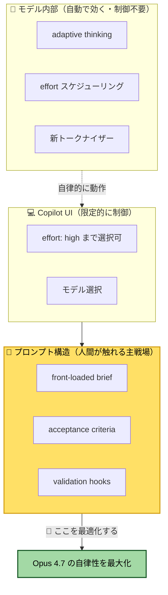
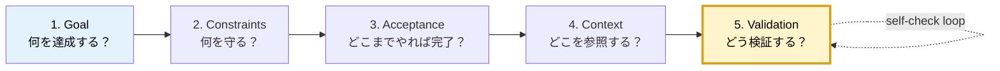

## はじめに

GitHub Copilot からモデルを **Claude Opus 4.7** に切り替えて使い始めたとき、ふと立ち止まりました。

「同じ書き方の指示を、別のモデルに使い回していていいのだろうか？」

LLM はモデルごとに性格が違います。得意な思考パターン、好む情報の渡し方、苦手な指示の出し方 ─ これらは少しずつ違います。にもかかわらず、私たちは多くの場合、**同じプロンプトをモデルが変わっても使い回しています**。

Anthropic は Opus 4.7 のリリースに合わせて [Best practices for using Claude Opus 4.7 with Claude Code](https://claude.com/blog/best-practices-for-using-claude-opus-4-7-with-claude-code) を公開しました。読んでみると、4.6 と 4.7 では **指示の出し方を変えた方がよい** とはっきり書かれています。新しいトークナイザー、`adaptive thinking` への一本化、デフォルト effort の変更 ─ モデル側の挙動が変わっているので、人間の側も合わせる必要がある、という主旨です。

ここで私が考えたのは、こういうことです。

- LLM ごとに特長があるなら、**特長に合わせて指示の型を最適化したい**
- 4.7 用の「型」が決まっているなら、それを毎回ゼロから書き起こすのは面倒
- だったら **GitHub Copilot の Agent Skill として、その型を自動生成させればいい**

そうして作ったのが [`claude-prompt-optimizer`](https://github.com/shinyay/claude-prompt-optimizer) という Agent Skill です。

この記事では以下の 3 つを共有します。

1. **なぜ Opus 4.7 で指示の型を変える必要があるのか** ─ Anthropic の公式知見と、それを GitHub Copilot 経由で使う場合の現実
2. **`claude-prompt-optimizer` の中身** ─ Agent Skill としての設計、5 スロットブリーフ、preset 切替
3. **実際に使ってみた結果** ─ 数行の依頼から、9 ファイル + テスト緑の FastAPI アプリが 1 ターンで生成されるまで

「動かなくて困ったから直した」ではなく、「**特長を最大限引き出したいから設計した**」というアプローチの記録です。

> 💡 この記事は **GitHub Copilot から Opus 4.7 を使うこと** を前提としています。Claude Code (Anthropic 純正 CLI) には触れません。

---

## Opus 4.7 で何が変わったのか

### モデル側で起きた変化

Anthropic 公式記事から、4.6 → 4.7 で実際に変わったポイントを整理します。

| 項目 | 4.6 | 4.7 |
|---|---|---|
| **トークナイザー** | 旧 | 新（同テキストで 1.0〜1.35倍 のトークン消費）|
| **デフォルト effort** | `high` | **`xhigh`**（`high` と `max` の中間として新設）|
| **Extended Thinking** | fixed budget 指定可 | **`adaptive thinking` のみ**（モデルが自律判断）|
| **応答長** | 全般に冗長 | **タスク複雑度にキャリブレーション**（短い時は短い）|
| **ツール呼び出し** | 多め | **減少**（先に思考する傾向が強い）|
| **サブエージェント生成** | 多め | **控えめ**（明示的に求めないと展開しない）|
| **`temperature` `top_p` `top_k`** | カスタム値 OK | **カスタム値で 400 エラー** |

特に大きいのは **`adaptive thinking` への一本化** です。これまで「何トークンまで考えていいよ」と人間が予算を渡していた仕組みがなくなり、モデル自身が「ここは深く考える」「ここは即答」を判断するようになりました。

長セッションの後半ほど思考量が増えやすい、という傾向もアナウンスされています。これは **早い段階で情報を与えるほど効率が良くなる** ことを示唆しています。

### Anthropic が示すメンタルモデル

公式記事の中で、Anthropic は次のように表現しています。

> "Treat Claude more like a capable engineer you're delegating to than a pair programmer you're guiding line by line."
>
> （Claude を、行ごとに導くペアプロ相手というより、タスクを委譲する有能なエンジニアとして扱え）

この一文が 4.7 の使い方の本質を突いています。整理すると、推奨は次の 2 点に集約できます。

1. **タスクは最初のターンで front-load する** ─ 意図、制約、受け入れ基準、関連ファイルパスを最初に揃える
2. **ユーザーターン数を減らす** ─ ターンごとに reasoning overhead が乗るため、質問はまとめて投げる

「対話を重ねながら少しずつ詰めていく」スタイル ─ つまり 4.6 的な使い方 ─ は、4.7 では **トークン効率も品質も落としやすい** とまで書かれています。

### GitHub Copilot ユーザーから見た現実

ここからが、この記事の核心です。

Anthropic 公式が示すレバーのうち、**GitHub Copilot から触れるものは限られます**。私自身、Copilot Chat の UI で `xhigh` を選ぼうとして「あれ、`high` までしかない」と気づきました。

整理するとこうなります。

| Anthropic の推奨 | Copilot UI で制御可能か | Copilot ユーザーの対応 |
|---|---|---|
| `effort: xhigh` をデフォルトに | ❌ `high` まで | **`high` で十分機能する**（後述の実例で 9 passed） |
| `adaptive thinking` を使う | ❌ ユーザー制御不可 | **意識不要**（モデル側で自動的に効く） |
| `temperature` などを廃止 | ❌ もとから UI で触れない | **影響ゼロ** |
| 新トークナイザー | ❌ ユーザー制御不可 | コスト感だけ知識として持つ |
| 応答長キャリブレーション | ✅ プロンプトで制御 | 望む長さは「正の例」で示す |
| ツール呼び出しを増やしたい | ✅ プロンプトで制御 | 「いつ・なぜ使うか」を明示 |
| サブエージェントを増やしたい | ✅ プロンプトで制御 | fan-out 用途では明示的に指示 |
| **タスクを front-load する** | ✅ **プロンプト構造そのもの** | 🔑 主戦場 |
| **acceptance + validation を渡す** | ✅ プロンプト構造そのもの | 🔑 self-check ループの起点 |
| **ユーザーターン数を減らす** | ✅ プロンプトの書き方で制御 | 🔑 1 ターンに intent を集約 |



つまり Copilot ユーザーから見ると、**「人間が手を入れられるレバーは『プロンプトの構造そのもの』しかない」** という結論になります。

これがスキル開発の動機です。レバーが 1 つしかないなら、**そのレバーを最大限引きやすくする道具** を作ればいい。

> 💡 **ポイント**: モデル側のチューニング（effort/thinking/temperature）に振り回される必要はありません。Copilot ユーザーが集中すべきは「プロンプトの構造」だけです。

---

## 4.7 の特長に合わせた「指示の型」── 5 スロットブリーフ

### なぜ 5 つに分けるのか

front-loading と一言で言っても、何をどの順で書くかが決まっていなければ毎回構成に悩みます。Anthropic の推奨を分解すると、以下の **5 つのスロット** に整理できます。

| スロット | 役割 | これがないと… |
|---|---|---|
| **1. Goal** | 成功とは何か（平易な言葉で）| モデルが「何を作るか」自体を解釈し始める |
| **2. Constraints** | やってよいこと / 絶対にやってはいけないこと | スコープが勝手に膨らむ（`while I'm here` 問題）|
| **3. Acceptance criteria** | 観測可能・テスト可能な完了条件 | 「どこまでやれば終わりか」が曖昧で、無限に磨き続ける |
| **4. Context** | 関連ファイルパス・既存決定事項・命名規約 | 既存コードと噛み合わない実装になる |
| **5. Validation** | 実行すべきテスト・コマンド・期待出力 | 実装後に動作確認が走らず、品質が運任せになる |



5 つのスロットがすべて埋まっていれば、4.7 はターン 1 のうちに「全体像」「制約」「完了条件」「参照点」「検証手段」を把握できます。これが front-loading の中身です。

### Validation スロットが「最大の品質レバー」である理由

5 つのうち、特に重要なのが **Validation スロット** です。Anthropic は self-validation の仕組みを与えることを `the single highest-leverage thing you can do`（最大の品質レバー）と表現しています。

なぜか？ 4.7 は **テスト・コマンド・期待出力を渡されると、自分で実行して検証し、失敗したら修正するループを回すから** です。

具体的には、Validation スロットに次のようなものを入れます。

```
Validation:
1. 依存インストール
     pip install -e .
2. テスト実行
     pytest -q
   → 全テスト pass、失敗 0
3. 起動して smoke test
     uvicorn app.main:app --reload
   別ターミナルで:
     curl -s -X POST localhost:8000/todos \
       -H 'Content-Type: application/json' \
       -d '{"title":"buy milk"}' | jq .
   → 201 相当のレスポンス、id と created_at が含まれる
4. 上記が失敗したら、修正 → 再実行 を pass するまで繰り返すこと
```

最後の **「失敗したら、修正 → 再実行 を pass するまで繰り返すこと」** が決定的に効きます。これを書くだけで、モデルは pytest の出力を読んで自己修正し始めます。後述の実例では、これによって人間の介入なしに「最初のコード生成 → テスト失敗 → 修正 → 全 pass」までモデルが自走しました。

逆に Validation を空欄にすると、4.7 の最も価値ある特長 ─ self-validation の自律性 ─ を完全に殺してしまいます。

### front-loading が効く理由

「最初に全部書く」という発想は一見、面倒に見えます。短く投げて対話で詰めていく方が自然なはずです。

しかし 4.7 では、これは逆転します。

- **ターンごとに reasoning overhead が乗る** ─ 各ユーザーターンの後、モデルは「これまでの文脈をもう一度組み立てる」思考を走らせる
- **4.7 はターン後半ほど思考量が増える傾向** ─ 公式アナウンス通り、長くなるほどコストが嵩む
- **対話の途中で軌道修正すると、すでに進んだ方向の作業が無駄になる**

front-loading は単なる「丁寧な書き方」ではなく、**4.7 のコストモデルを前提にした合理的な選択** です。

> 💡 **ポイント**: 「短く投げて対話で詰める」は 4.6 までの最適解。4.7 では「最初に揃えて一気に走らせる」が最適解に変わりました。

---

## claude-prompt-optimizer ─ 5 スロットブリーフを生成する Agent Skill

### Agent Skill とは何か（GitHub Copilot 文脈）

GitHub Copilot の **Agent Skill** は、再利用可能な専門知識を `SKILL.md` というファイルにまとめ、必要に応じて自動で読み込む仕組みです。

特徴:

- **Discovery は frontmatter ベース** ─ `description` フィールドに書かれた内容から、Copilot が「このタスクにこのスキルが効きそう」を自動判断
- **2 つのランタイムで使える** ─ 同じスキル定義が **Copilot CLI** と **VS Code Copilot Chat** の両方で動作
  - Copilot CLI: `~/.copilot/skills/`
  - VS Code Copilot Chat: workspace の `.github/skills/`
- **3 段階ロード** ─ Discovery（frontmatter）→ Instructions（SKILL.md 本文）→ Resources（必要なときだけ参照ファイル）

つまり、書いておけば **必要なときに自動で出てきて、不要なときはコンテキストを汚さない** という設計です。

### このスキルが自動化すること

`claude-prompt-optimizer` は、**人間の数行入力を 4.7 向けの完成形ブリーフに変換する** ことだけを目的としたスキルです。

入力と出力のイメージ:

```
人間の入力（数行）
        ↓
"Python + FastAPI で ToDo API を作りたい。
 SQLite。認証/ユーザー管理/Docker は不要。"
        ↓
─────────── スキルが処理 ───────────
        ↓
完成形の 5 スロットブリーフ（80行）
Goal: ...
Constraints: ...
Acceptance criteria: ...
Context: ...
Validation: ...
```

スキルには 2 つのモードがあります。

| モード | 用途 |
|---|---|
| **`generate`** | 0 から 5 スロットブリーフを生成する |
| **`audit`** | 既存プロンプトを 4.7 観点で監査し、deprecated パターンを指摘する |

さらに **preset** で対象モデルを切り替えられます（`opus-4-7` / `opus-4-6`）。これにより、4.7 用と 4.6 用で別々の指示の型を出し分けることができます。

### スキル使用の典型フロー

VS Code Copilot Chat での使用例です。

1. **トリガー**: 「claude-prompt-optimizer で TODO API のプロンプトを generate して」と話しかける
2. **対話**: スキルが mode（generate/audit）と preset（opus-4-7/opus-4-6）を確認
3. **入力**: ユーザーが「やりたいこと」を数行で伝える
4. **生成**: スキルが 5 スロットブリーフを出力（Validation 欄も自動で具体コマンド付きで埋める）
5. **実行**: 出力されたブリーフをそのまま次のプロンプトに貼り付け、Copilot (Opus 4.7) が実装に入る

人間が書くのは **手順 1〜3** までで、合計 5〜10 行程度。あとはスキルと Copilot が引き受けます。

---

## スキルの中身を覗く

### ディレクトリ構成

スキル一式は次の構成です。

```
.github/skills/claude-prompt-optimizer/
├── SKILL.md                       # エントリポイント（DO/DON'T、操作手順）
├── references/
│   ├── presets/
│   │   ├── opus-4-7.md            # 4.7 用の推奨設定・deprecated 一覧
│   │   └── opus-4-6.md            # 4.6 用（fallback）
│   ├── agent-system-prompt.md     # スキル内部用のシステムプロンプト指針
│   ├── behavioral-changes.md      # 4.6 → 4.7 の挙動変化リスト
│   ├── breaking-changes.md        # 破壊的変更（temperature 廃止など）
│   └── validation-patterns.md     # Validation スロットの書き方カタログ
├── templates/
│   ├── generate.md                # generate モードの出力テンプレート
│   └── audit.md                   # audit モードの出力テンプレート
└── scripts/
    └── lint-prompt.sh             # 完成プロンプトの静的チェック
```

`references/` は **スキルが必要時にだけロードする補助ファイル** です。SKILL.md 本体を肥大化させず、深い情報は分離しています。

### SKILL.md の DO / DON'T 設計

`SKILL.md` の中核は **DO / DON'T のルールセット** です。一部を抜粋します。

**DO（やるべきこと）**

- ユーザーから mode と preset の指定がない場合は **`ask_user` で必ず確認する**
- `references/presets/` を **読み込んでから** 変換に入る（推測で書かない）
- 5 スロットすべてを **必ず埋める**（空欄禁止）
- 出力後に **`scripts/lint-prompt.sh`** を回し、deprecated 構文を最終チェック

**DON'T（やってはいけないこと）**

- ユーザーが言っていない acceptance criteria を **勝手に発明しない** ─ 不明点は `<TODO: confirm>` マーカーで残す
- `temperature` `top_p` `--dangerously-skip-permissions` などの 4.7 で deprecated な構文を出力に含めない
- 「step by step」「pause after each step」のようなペアプロ誘導フレーズを使わない

特に重要なのは **「invent しない」** というルールです。4.7 は強力なため、放っておくと「妥当そうな落としどころ」を勝手に埋めてしまいます。これは便利な反面、**ユーザーの意図と微妙にずれた仕様が紛れ込むリスク** があります。`<TODO: confirm>` マーカーで「ここは推測です、確認してください」と明示することで、人間のレビュー対象を可視化します。

### preset 設計：4.6 と 4.7 を切り替え可能にした意図

なぜ preset を 1 つに固定せず、4.6 用と 4.7 用を分けたのか。理由は 3 つあります。

1. **モデルは進化していく** ─ 4.7 が今のベストでも、半年後にはまた変わっている可能性が高い。preset を切り替え可能にしておけば、新モデルが出たときも `presets/opus-X.md` を追加するだけで済む
2. **古いモデルへフォールバックするケース** ─ 何らかの理由で 4.6 を使う場面（コスト、可用性、テスト目的）でも、その世代に最適化された型が必要
3. **「指示の型」自体がモデル世代ごとに違う** ─ 例:

   | 観点 | 4.6 preset | 4.7 preset |
   |---|---|---|
   | `temperature` | 設定 OK | **使用禁止（400 エラー）** |
   | thinking budget | 数値で指定可 | **`adaptive` のみ** |
   | step-by-step 誘導 | 有効 | **逆効果（ペアプロ化を招く）** |
   | サブエージェント | 積極的に使う | **明示しないと使われない** |
   | Validation スロット | あれば良い | **必須（最大の品質レバー）** |

preset は単なる設定値の差分ではなく、**「モデルとの付き合い方そのもの」のバージョン管理** だと考えています。

### lint-prompt.sh による静的チェック

最後の砦が `lint-prompt.sh` です。これは出力済みのプロンプトを正規表現でスキャンし、4.7 で deprecated な構文を検出するシェルスクリプトです。

検出対象の例:

- `temperature: <数値>`
- `top_p: <数値>` / `top_k: <数値>`
- `thinking: { type: "enabled", budget_tokens: ... }`
- `--dangerously-skip-permissions`
- `effort: max` がデフォルト指定されている

スキル本体の生成ロジックが完璧でも、人間が手で書き換えたあとに deprecated 構文が紛れ込むことはあります。lint で機械的に弾くことで、**「ヒトのミス」を最終ガードレールで止める** 構造にしています。

---

## 実際に使ってみる ── ToDo API の例

ここからは実例です。スキルの効果を、実データで示します。

### 環境

- **エディタ**: VS Code Insiders
- **Copilot**: GitHub Copilot Chat（モデル: **Claude Opus 4.7**、effort: `high`）
- **リポジトリ**: `awesome-shinyay-copilot-template`
- **スキル配置**: `.github/skills/claude-prompt-optimizer/`

### ステップ 1：人間の入力（数行）

私が Copilot Chat に書いたのは、これだけです。

```
claude-prompt-optimizer を使って、以下のプロンプトを generate モードで作って:

Python + FastAPI + SQLite で ToDo 管理 Web アプリを新規作成したい。
単一ユーザーが REST API で CRUD できれば OK。
認証・ユーザー管理・Docker は不要。
```

**5 行の入力** です。仕様書は書いていません。

### ステップ 2：スキル出力（完成形のブリーフ）

スキルが返してきたブリーフがこちらです。長いので折りたたみで掲載します。

:::details スキルが生成した 5 スロットブリーフ（全文）
```
Goal:
Python + FastAPI + SQLite(async) で ToDo 管理 Web アプリを新規作成する。
単一ユーザーが ToDo の CRUD を REST API 経由で行える、最小だが本番品質に近い
バックエンドを 1 リポジトリとして立ち上げることがゴール。

Constraints:
- 言語/フレームワーク: Python 3.11+ / FastAPI(最新安定) / Uvicorn
- DB: SQLite を非同期で扱う(SQLAlchemy 2.x async + aiosqlite を使用)
- バリデーション: Pydantic v2(BaseModel、model_config、Field)
- すべてのエンドポイントと DB アクセスは async/await
- 依存管理は pyproject.toml + uv または pip(どちらか 1 つに統一)
- 以下はスコープ外。実装・依存追加・コメント言及いずれもしない:
  - 認証 / 認可(JWT, OAuth, Basic 等を一切入れない)
  - ユーザー管理(users テーブル・サインアップ・ロール)
  - Docker / Dockerfile / docker-compose / コンテナ前提の設定
- ファイル分割は責務ごと(main / router / schemas / models / db / dependencies)

Acceptance criteria:
- 起動: uvicorn app.main:app --reload がエラーなく起動し、初回起動時に
  SQLite ファイルとテーブルが自動作成される
- エンドポイント仕様:
  - POST   /todos           → 201, 作成された ToDo を返す
  - GET    /todos           → 200, ToDo 配列(クエリ ?completed= で絞り込み可)
  - GET    /todos/{id}      → 200 / 404
  - PATCH  /todos/{id}      → 200 部分更新 / 404
  - DELETE /todos/{id}      → 204 / 404
- バリデーション違反は 422 を返し、Pydantic のエラー詳細が含まれる
- /docs(Swagger UI)で全エンドポイントのスキーマと例が閲覧できる
- pytest が green。最低限カバー: 各エンドポイントの正常系 + 404 + 422
- テストは独立した SQLite(in-memory もしくは tmp ファイル)で実行

Context:
- 想定リポジトリ構成(新規作成):
    pyproject.toml
    app/
      main.py            # FastAPI app + lifespan で create_all
      db.py              # async engine, sessionmaker, get_session 依存
      models.py          # SQLAlchemy 2.x DeclarativeBase + Todo モデル
      schemas.py         # Pydantic v2 スキーマ
      router.py          # /todos ルーター
      dependencies.py    # get_session など共通依存
    tests/
      conftest.py
      test_todos.py
- 採用慣行:
  - SQLAlchemy 2.x の Mapped[...] / mapped_column(...) スタイル
  - Pydantic v2 で from_attributes=True
  - FastAPI の lifespan で起動時にテーブル作成
  - リポジトリパターンを過剰設計しない

Validation:
以下を順に実行し、すべて成功することを self-check すること:
1. 依存インストール: pip install -e .
2. テスト: pytest -q  → 全テスト pass、失敗 0
3. 起動と smoke test:
     uvicorn app.main:app --reload
   別ターミナルで:
     curl -s -X POST localhost:8000/todos \
       -H 'Content-Type: application/json' \
       -d '{"title":"buy milk"}' | jq .
     # → 201 相当、id と created_at が含まれる
     curl -s localhost:8000/todos | jq .
     curl -s -X PATCH localhost:8000/todos/1 \
       -H 'Content-Type: application/json' \
       -d '{"completed":true}' | jq .
     curl -i -X DELETE localhost:8000/todos/1
     # → 204
4. http://localhost:8000/docs を開いて Try it out で全エンドポイント確認
5. 422 系: curl -i -X POST localhost:8000/todos \
       -H 'Content-Type: application/json' -d '{}' → 422
上記 1〜5 のいずれかが失敗した場合は、修正 → 再実行 を pass するまで繰り返すこと。
```
:::

5 行 → 80 行に展開されました。注目すべき点:

- **Constraints でスコープ外を 3 重に明示** ─ 「実装・依存追加・コメント言及いずれもしない」と書くことで、4.7 が "while I'm here" で勝手に拡張するのを抑止
- **Validation に curl + pytest の具体コマンド** ─ self-check ループの起点
- **Acceptance criteria でエンドポイント仕様を完全固定** ─ ステータスコードまで含める
- **末尾の自己ループ指示** ─ 「失敗したら修正→再実行を pass するまで繰り返す」が決定的に効く

### ステップ 3：実行

このブリーフをそのまま Copilot Chat の次のプロンプトに貼り付け、`Enter` を押しました。

人間がした作業はそれだけです。

### ステップ 4：結果

Copilot (Opus 4.7) は約 1 ターンで以下を生成しました。

**生成ファイル（9 個）**

```
examples/todo-fastapi/
├── pyproject.toml
├── README.md
├── .gitignore
├── app/
│   ├── main.py            # FastAPI app + lifespan
│   ├── db.py              # async engine + sessionmaker
│   ├── models.py          # SQLAlchemy 2.x Todo モデル
│   ├── schemas.py         # Pydantic v2 スキーマ
│   ├── router.py          # /todos CRUD
│   └── dependencies.py    # get_session
└── tests/
    ├── conftest.py        # in-memory SQLite + dependency_overrides
    └── test_todos.py      # 9 ケース
```

**テスト結果**

```bash
$ pytest -q
.........                                                                [100%]
9 passed in 0.33s
```

**Smoke test 結果（curl で全エンドポイント確認）**

| 操作 | ステータス | 期待値 |
|---|---|---|
| POST /todos（正常） | 201 | ✅ |
| GET /todos | 200 | ✅ |
| PATCH /todos/1 | 200 | ✅ |
| DELETE /todos/1 | 204 | ✅ |
| POST /todos（空ボディ） | 422 | ✅ |
| GET /todos/9999 | 404 | ✅ |
| GET /health | 200 | ✅ |

**全項目 green** です。Copilot は途中で `pytest` の出力を見て、エラーがあった箇所を自分で修正していました（依存インストール時の些細な問題を、`--without-pip` を使った代替手段で自己解決）。

### この結果から見えること


得られた示唆:

- **front-loading は本当に効く** ─ ターン 1 で揃えれば、質問返しゼロで実装まで走る
- **Validation スロットは self-check ループを駆動する** ─ pytest と curl のコマンドを書いただけで、モデルが自分で実行・修正する
- **人間の入力量は最小化される** ─ 「5 行の依頼で動くものが返ってくる」体験は、4.6 までの感覚とは明確に違う

そして何より、**スキル経由で書いたプロンプトは、自分でゼロから書くより速くて完成度が高い**。これがスキル化の最大の価値です。

> 💡 **ポイント**: 「数行の依頼 → 完成度の高い実装」は魔法ではなく、5 スロットブリーフという型を介した結果です。型があるから、人間も少なく書けるし、モデルも迷わず動けます。

---

## 設計の勘所と限界

うまくいった話だけでは記事として不誠実なので、課題も共有します。

### スキルが silent に invent してしまう問題

今回の出力には、ユーザーが言っていない仕様が含まれていました。

- `title` は 1〜200 文字制約
- `description` は最大 2000 文字
- `?completed=true|false` クエリで絞り込み可
- `created_at` / `updated_at` フィールドの存在
- ファイル分割の具体的な命名（`app/main.py` など）

これらは **「妥当な落としどころ」ではあります**。しかし、ユーザーが指定していない以上、本来は `<TODO: confirm>` マーカーで明示すべきでした。スキルの DON'T ルール「invent しない」に対する軽微な逸脱です。

なぜ起きたか考えると、**4.7 自身の自律性が高いため、スキルの抑制力よりモデルの埋めたがりが勝ってしまった** のだと思います。対策として、preset 側に「以下のような項目は必ず `<TODO: confirm>` で残せ」というチェックリストを追加することを検討中です。

これは **強力なモデルを使うときの普遍的な課題** でもあります。能力が高いほど「気を利かせる」傾向が強く、それが時に意図と微妙にずれます。invent を 100% 防ぐのは難しいので、**人間のレビューを前提とした設計** が現実解です。

### front-loading が効きにくい場面

5 スロットブリーフは万能ではありません。次のような場面ではむしろ重い手段になります。

- **探索的タスク** ─ 仕様自体が手探りで、対話しながら方向を決めたい
- **短時間の局所修正** ─ 1 ファイル内のリファクタリング、typo 修正
- **デバッグの初期段階** ─ そもそも問題が何かを特定したい

こういうときは、ペアプロスタイル（短く投げて反応を見る）の方が効率的です。スキルは **「中〜大規模で要件が見えている」タスク専用の道具** と割り切るのが正解です。

### モデル進化への追従コスト

preset を分離した設計の代償は、**preset を増やすほどメンテナンスコストが上がる** ことです。

- 新モデルが出るたびに `presets/opus-X.md` を追加・更新する必要がある
- 4.6 と 4.7 のような明確な世代差があれば良いが、マイナーアップデートをどこまで preset に反映するか判断が悩ましい
- preset 間の整合性（同じ概念が別の言葉で書かれていないか）の維持コスト

この問題への完全な解はまだありません。当面は **「メジャー世代ごとに 1 preset」** の運用ルールで運用しつつ、将来的には preset の DSL 化（共通部分と差分の分離）も検討対象です。

---

## まとめ

### LLM ごとの特長に合わせた指示設計という考え方

この記事の根っこにある問題意識は、**「モデルが変われば指示も変わる」** ということです。

LLM はモデルごとに性格があります。4.6 が好む書き方と、4.7 が好む書き方は違います。にもかかわらず、私たちは多くの場合、同じ書き方を使い回しています。

LLM をブラックボックスとして扱うのではなく、**「外部委託先」として、その委託先の特長に合わせた仕様書を書く** ─ この姿勢が、これからのプロンプト設計には必要だと感じています。

### Copilot ユーザーが触れる「唯一のレバー」を最大化する

GitHub Copilot から Opus 4.7 を使う場合、**人間が触れるレバーはプロンプトの構造だけ** です。`effort` も `thinking` もモデルが内部で判断します。これは制約のようでいて、**集中すべき対象が明確になる** という意味で、むしろポジティブに捉えられます。

レバーが 1 つしかないなら、そのレバーを最大限引きやすくする道具を作ればいい ─ それが `claude-prompt-optimizer` です。

### 読者への問いかけ

最後に、あなたに問いかけたいことがあります。

- あなたが日常的に使っている **LLM の「特長」** を意識していますか？
- 同じプロンプトを **別モデルで使い回していませんか**？
- そのプロンプトに **Validation スロット** は入っていますか？
- モデルが進化したとき、あなたの **「指示の型」も進化** していますか？

### 3 つのキーメッセージ

1. **モデルが変われば指示も変わる** ─ 一律の書き方は通用しない時代に入った
2. **Copilot ユーザーが触れるレバーは「プロンプトの構造」だけ** ─ そこに集中すれば 4.7 の自律性は引き出せる
3. **Agent Skill で「指示の型」を再利用する** ─ 毎回ゼロから書かないことが、継続的な品質を生む

LLM は道具ですが、**道具との付き合い方そのものをデザインする時代** が来ているのだと思います。

---

📎 **関連リソース**

- [Best practices for using Claude Opus 4.7 with Claude Code](https://claude.com/blog/best-practices-for-using-claude-opus-4-7-with-claude-code) (Anthropic 公式)
- [claude-prompt-optimizer](https://github.com/shinyay/claude-prompt-optimizer) (本記事で紹介したスキル)
- [GitHub Copilot Agent Skills ドキュメント](https://docs.github.com/copilot)
